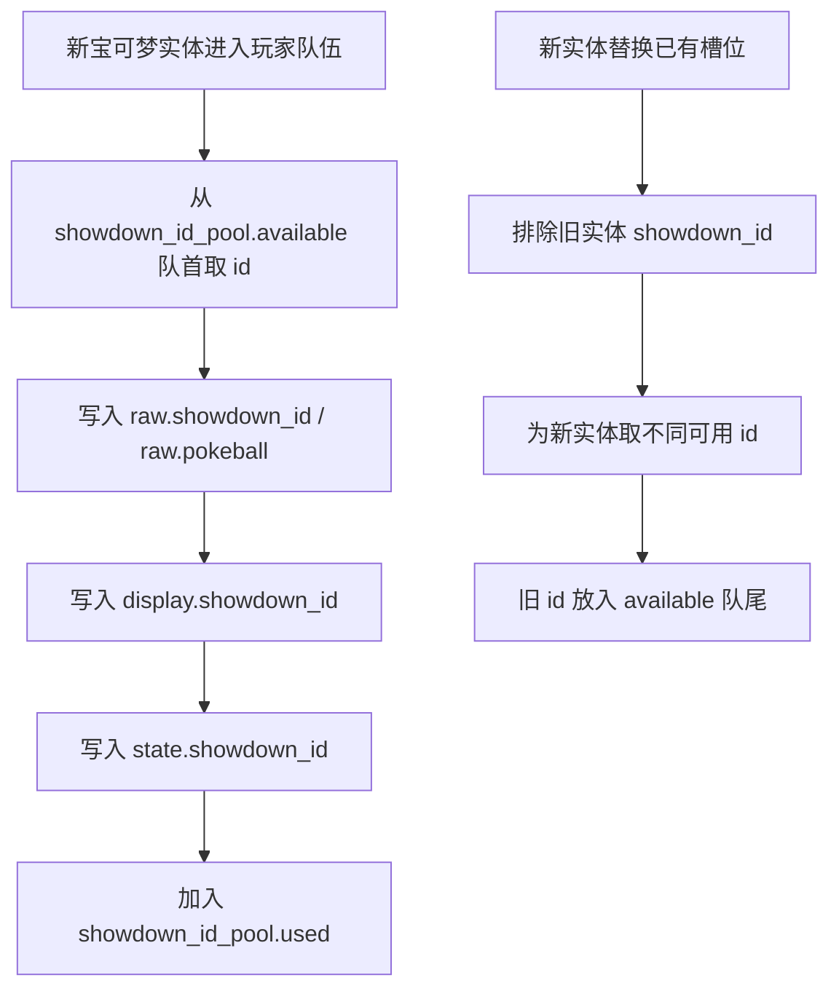
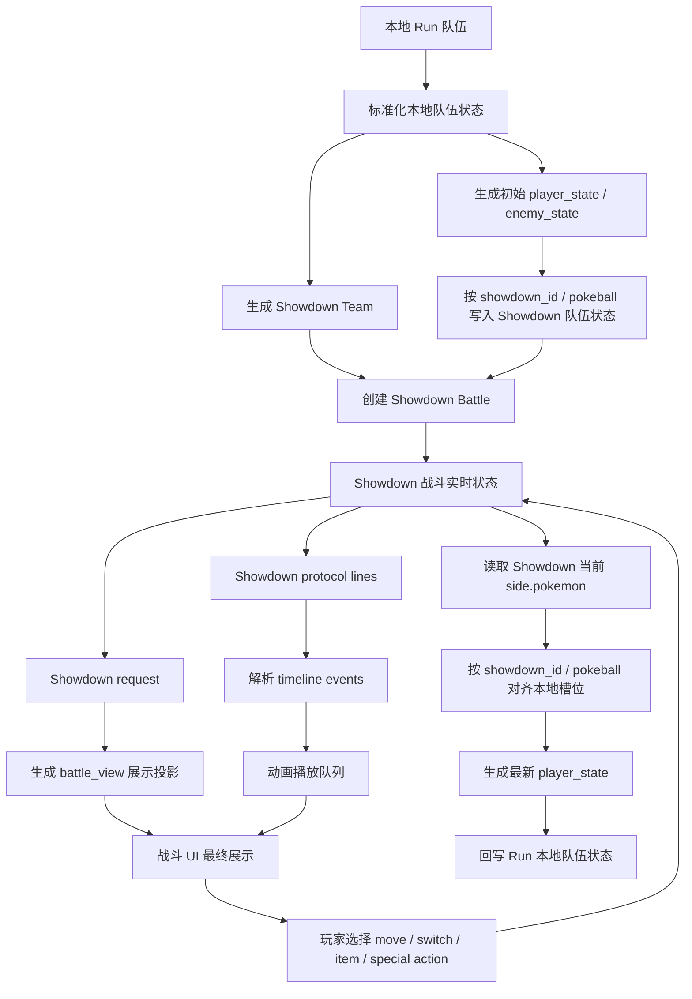
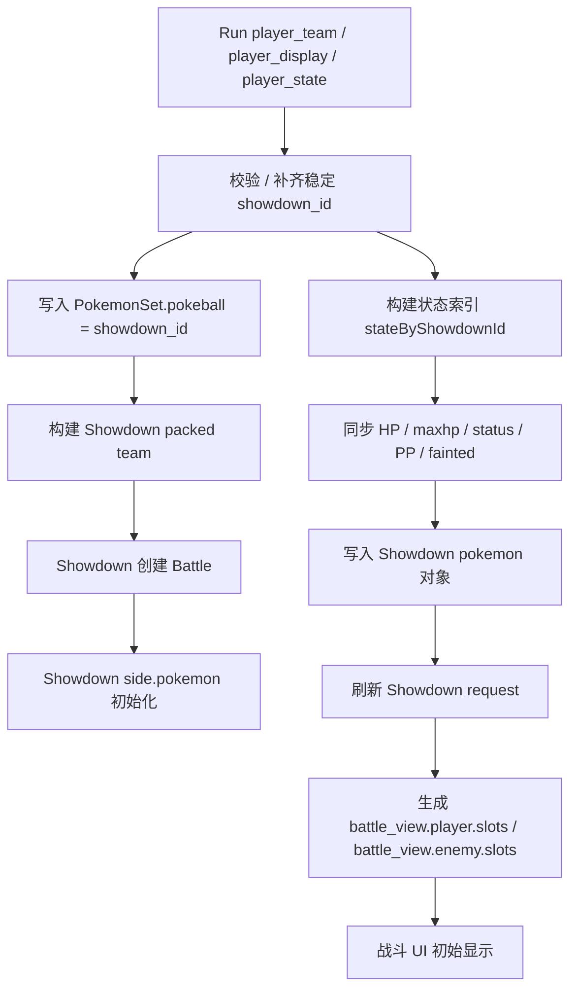
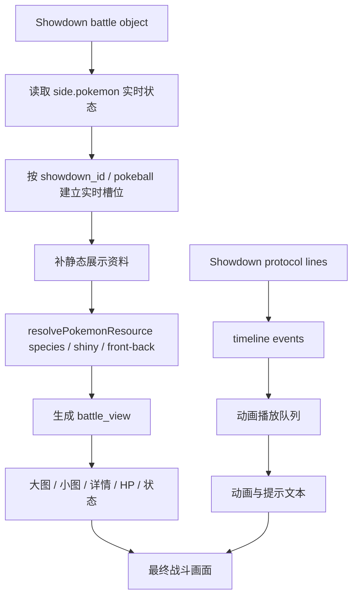
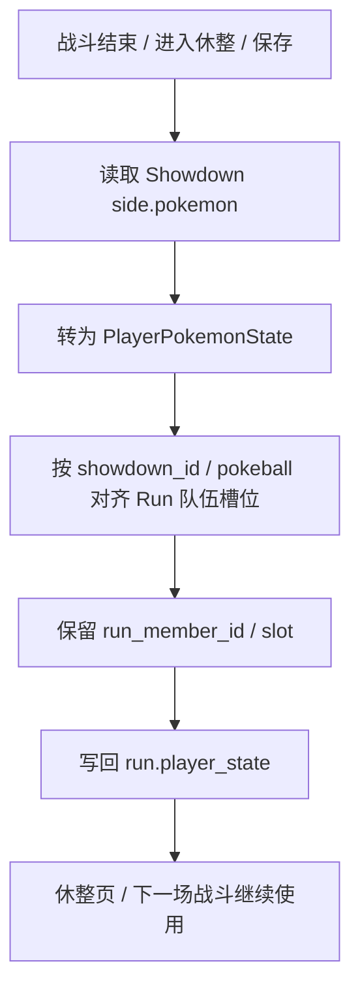

# Battle Team State Flow

这份文档记录 ChangeBattle 如何在本地队伍和 Pokemon Showdown 战斗队伍之间同步状态。

[`battle-timeline-flow.md`](./battle-timeline-flow.md) 只负责解释战斗回合、协议事件和动画播放顺序；[`showdown-identity.md`](./showdown-identity.md) 负责记录 `showdown_id` / `pokeball` 的身份规则；本文负责描述 `local_team`、`showdown_team` / `battle_team`、展示投影和战后回写。

## 当前实现结论

先按现有代码落地口径记录，避免再把已经落地的展示投影误写成后续计划：

- 玩家 `showdown_id` 不是进战斗时才新建。它在宝可梦实体进入玩家 Run 队伍时写入，并保存在 `player_team`、`player_display`、`player_state` 三份数据里。
- 进战斗时，`BattleSession` 会把 `showdown_id` 转成 Showdown 可传输的 `PokemonSet.pokeball`，再用 `initialPlayerState` 把 HP、异常、PP、濒死等状态写进 Showdown 队伍。
- 敌方 `showdown_id` 不用玩家池。敌方 planned battle 生成时会给 `enemy_raw` / `enemy_display` 按队内唯一分配 id，不要求跨战斗唯一。
- `BattleSession.getState()` 已返回 `battle_view`。它是战斗页的统一展示投影，负责把 Showdown 当前状态、request runtime 行、tracker 当前形态和本地 display 资料合成给 UI 使用。
- React 战斗页的大图、小图、主面板、队伍栏、详情页、背包目标列表和换人菜单都应以 `battle_view` 为最终展示源。`request`、`tracker`、`timeline_events`、`player_display`、`enemy_display` 仍保留给行动、动画、AI、回合记录和兼容逻辑，但不再各自决定同一个宝可梦的最终 HP、状态、身份或贴图。

## 目标

战斗队伍有两个层级：

- 本地 Run 队伍：负责休整页、存档、下一场战斗和结算回写。
- Showdown 队伍：负责战斗中的实时 HP、异常、PP、濒死、当前上场和规则结算。

两者必须用稳定的 `showdown_id` / Showdown `pokeball` 关联。Mega、极巨、太晶、形态变化、换人、濒死都不能改变这个绑定。

核心原则：

- `showdown_id` 在宝可梦实体进入玩家 Run 队伍时分配；开战时只校验、补齐并写入 Showdown `pokeball`。
- 战斗规则事实源只能是 Showdown。前端不从本地队伍重算 HP、异常、PP、濒死或当前上场。
- 本地 `player_display` / `enemy_display` 只提供静态展示资料，例如中文名、属性、能力、图片和基础信息。
- 战斗 UI 的唯一最终展示源是统一展示投影 `battle_view`。React 组件不应分别混读 `request`、`tracker`、`timeline`、`player_display` 来决定同一个宝可梦的最终显示。
- Timeline events 只负责播放过程，不负责作为最终 HP、异常、贴图和队伍槽位的事实源。

## 身份分配

玩家当前 run 维护一个 `showdown_id_pool`：

```ts
{
  available: string[];
  used: string[];
}
```

新宝可梦进入玩家队伍时，从 `available` 队首取一个 id，写入 `raw.showdown_id`、`raw.pokeball`、`display.showdown_id` 和 `state.showdown_id`。

如果新实体替换已有槽位，当前实现会先排除旧实体的 id，给新实体取一个不同的可用 id，再把旧 id 放回 `available` 队尾。这样可以避免“新旧两个不同实体在同一次替换中复用同一个身份”。

这里的“稳定”限定在玩家当前队伍内。被替换出去的旧宝可梦进入 `exchange_box` 时会保留自己的旧 `showdown_id` 作为历史/展示资料，但该 id 会回到玩家当前队伍的可用池尾部，未来新实体可以再次拿到它。所以玩家池保证的是“当前 Run 队伍内唯一”，不是整局所有历史对象永不复用。



身份分配规则：

- 同一玩家队伍内 `showdown_id` 必须唯一。
- 排序、首发调整、技能调整、携带道具调整、性格/特性/个体/努力调整都不改变 `showdown_id`。
- 休整阶段把第一只可用宝可梦换到首位时，会同步交换 `player_team`、`player_display`、`player_state` 等数组位置，但 `showdown_id` 跟着实体移动。
- 新实体进入已有槽位时，必须拿不同于旧实体的新 id；旧实体的 id 进入池子队尾，后续才可复用。
- NPC 队伍也写入 `showdown_id`，但只要求该 NPC 队伍内唯一，不进入玩家 run 的身份池。

当前实现对应函数：

- `stablePlayerSlotShowdownId()`：读取已有槽位身份；缺失时从玩家池取新 id。
- `writePokemonShowdownId()` / `writePlayerSlotShowdownId()`：把同一个 id 写入 raw / display / state。
- `normalizeRunShowdownIdPool()`：修正玩家当前队伍内缺失或重复的 id，并重建 `used` / `available`。
- `takeRunShowdownId()`：新实体加入当前玩家队伍时从 `available` 队首取 id。
- `takeReplacementRunShowdownId()`：新实体替换已有槽位时，排除旧 id，取不同 id，并把旧 id 放回队尾。
- `rotateFirstUsable()`：只移动数组位置，不重分配 id。

### 敌方身份

敌方队伍的 `showdown_id` 是队伍内身份，不是跨整局身份。它的作用是让单场战斗里的敌方 `raw`、`display`、Showdown `pokeball`、timeline event 和 `battle_view` 能稳定对齐。

```mermaid
flowchart TD
  A[生成 planned battle enemy_raw / enemy_display] --> B[创建敌方队伍内 used 集合]
  B --> C[按槽位从 SHOWDOWN_ID_POOL 取未使用 id]
  C --> D[写入 enemy_raw[index].showdown_id]
  D --> E[写入 enemy_raw[index].pokeball]
  E --> F[写入 enemy_display[index].showdown_id]
  F --> G[保存到 planned_battles]
```

敌方身份规则：

- 每个敌方队伍内部 `showdown_id` 必须唯一。
- 不要求不同场战斗之间唯一；下一场敌方可以重新使用同一批 id。
- 敌方 `showdown_id` 不进入玩家 `showdown_id_pool`，也不会因为玩家交换、休整或回写而被回收到玩家池。
- `planned_battles` 生成时就应该写入敌方 `showdown_id`；`startNextBattle()` 读取预生成队伍，不应临场重新随机敌方身份。
- 如果休整事件把敌方宝可梦交换进玩家队伍，进入玩家队伍的那一刻必须重新从玩家池分配新的 `showdown_id`，不能沿用敌方队伍内 id。
- 如果玩家宝可梦被换入敌方队伍，整支敌方队伍会重新执行一次敌方队内 `showdown_id` 分配，确保敌方队伍内部仍唯一。

当前实现对应函数：

- `planned-battles.ts` 的 `assignEnemyShowdownIds()`：生成 planned battle 时给敌方队伍分配队内唯一 id。
- `rest-flow.ts` 的 `assignEnemyShowdownIds()`：休整交换导致 planned enemy team 改变后，重新分配敌方队内 id。
- `applyRaidExchange()`：敌方进玩家队伍时调用 `takeReplacementRunShowdownId()` 获取玩家池 id；玩家旧宝可梦进入敌方 planned team 后，敌方队伍重新执行 `assignEnemyShowdownIds()`。

## 总流程



## 进入战斗

进入战斗时，本地队伍已经应该带有稳定 `showdown_id`。开战流程只负责校验、补齐缺失身份、把 `showdown_id` 写成 Showdown 可传输的 `pokeball`，再把本地状态写入 Showdown。



进入战斗的验收标准：

- 休整页的半血、异常、PP 消耗、濒死状态进入战斗后必须存在于 Showdown `pokemon` 对象。
- 同步后 `request.side.pokemon[].condition` 必须和 Showdown 当前 HP / status 一致。
- UI 的大图、小图、详情页、队伍栏必须从 `battle_view` 读取同一份 condition，不能再各自从 request、tracker 或 display 拼状态。

## 战斗中展示

战斗中，Showdown 当前状态负责最终画面，timeline 负责动画过程。



展示层规则：

- 大图、小图、详情页和队伍栏都读取 `battle_view`，不能各自拼装身份、HP 和图片。
- `showdown_id` / `pokeball` 优先于英文名匹配。英文名只用于解析 species / forme 和资源。
- 形态变化只改变当前展示 species，不改变 `showdown_id`。
- 如果 Showdown 有某个形态而资源库缺专图，例如 `Vivillon-Garden`，资源解析应 fallback 到基础种图片，同时保留 Showdown 当前形态名用于展示和后续补资源。
- 未揭示对手槽位可以显示问号；已经上场的 active 槽位不能因为资源缺失或开场遮罩残留而显示问号。

当前实现里与展示有关的关键路径：

- `BattleSession.getState()`：返回 `request`、`tracker`、`timeline_events`、双方 raw/display，并生成完整 `battle_view`。
- `buildBattleView()` / `buildSideView()`：读取 Showdown side 状态、request runtime 行、tracker 当前形态和本地 display，合成 `battle_view.player.slots` / `battle_view.enemy.slots`。
- `applyRuntimeActiveToTracker()`：用 Showdown runtime 的 `pokeball` 找 display，并把 active 当前形态写入 tracker；`battle_view` 会吸收这份 active 形态信息。
- `syncRequestSideState()`：把同步后的 HP/status 写回 `request.side.pokemon[].condition`。
- `turnPokemonStates()` / `currentSideState()`：回合记录、`battle_view` 和战后状态从 Showdown side.pokemon 读取，再按 `showdown_id` / slot 对齐。
- `BattleView.tsx`：主战斗画面、FighterPanel、BattlePartyBoard、TeamMenu、PokemonDetailModal、BattleItemModal 都消费 `battle_view`；timeline 只做播放中的临时 active 动画覆盖，播放结束后回到 `battle_view` 的最终状态。

## 战后回写

战斗结束、进入休整或保存时，只从 Showdown 当前队伍状态回写本地 Run 队伍。



回写规则：

- 回写字段包括 HP、max HP、异常状态、PP、濒死状态和是否当前上场。
- 本地静态展示资料不能覆盖 Showdown 回写的战斗状态。
- 如果战后需要恢复普通形态，那是 species/display 层逻辑，不影响 HP、PP、异常和 `showdown_id` 绑定。
