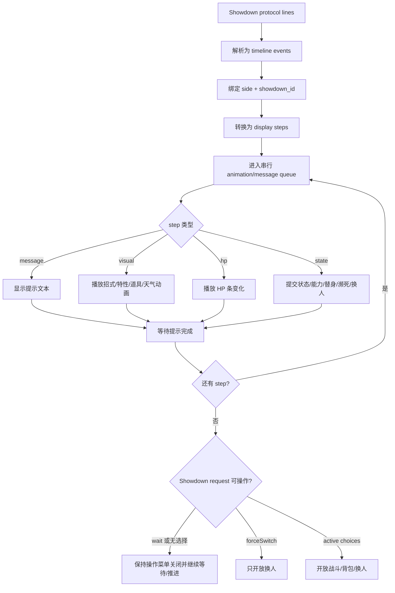
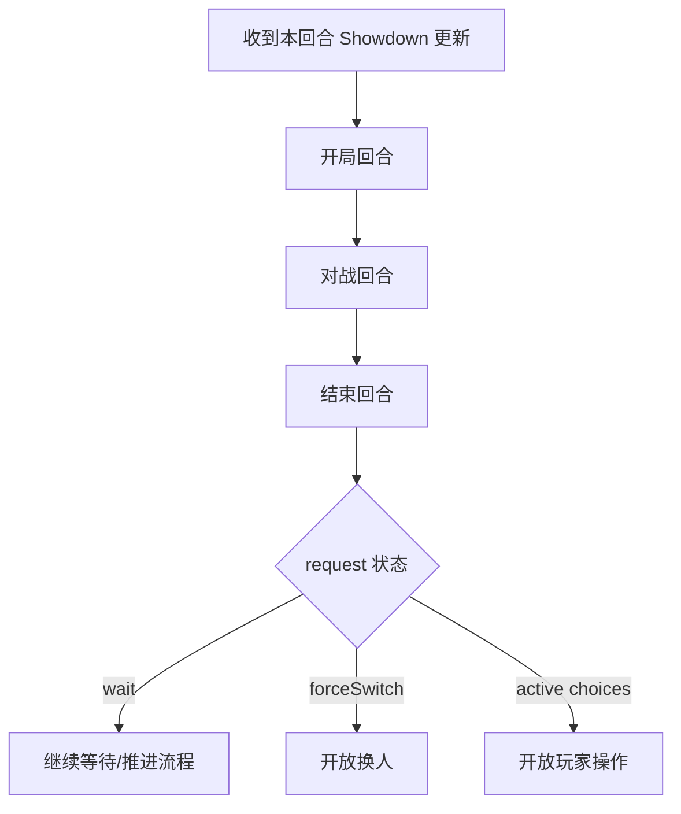
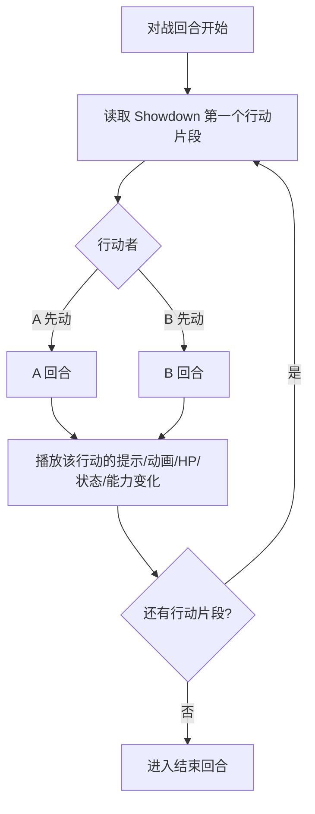
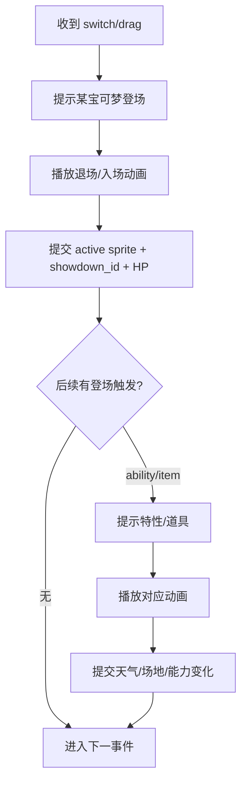
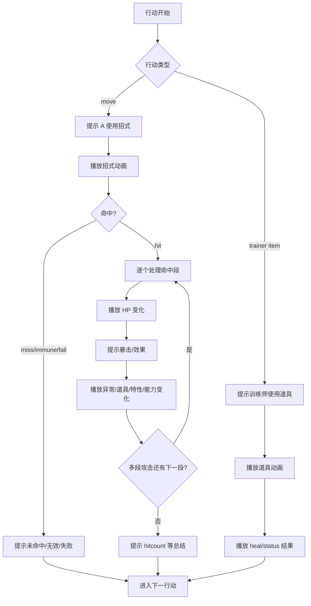
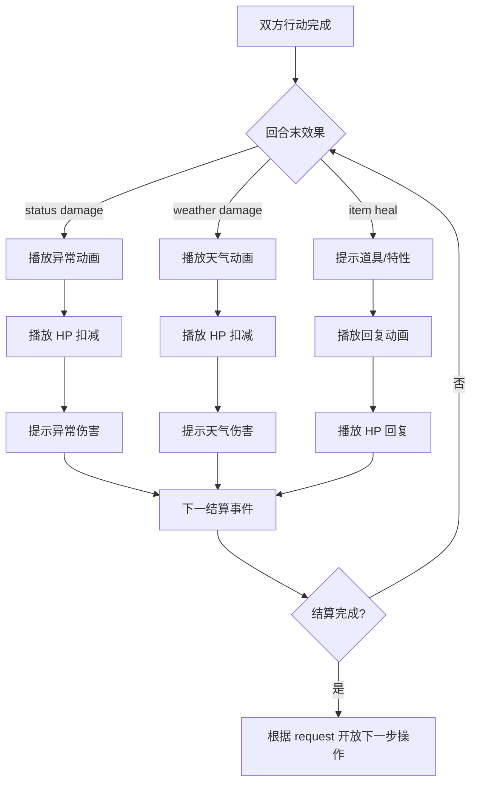

# Battle Timeline Flow

这份文档记录 ChangeBattle 桌面端应该如何把 Pokemon Showdown 返回的协议日志展示成战斗流程。

`showdown-battle-log.md` 负责解释协议行和 timeline event 的解析原则；[`showdown-identity.md`](./showdown-identity.md) 负责记录 `showdown_id`、Showdown `pokeball` 传输、side 识别和回写规则；本文负责描述前端播放顺序、动画等待点和 UI 状态提交时机。

## 目标

Pokemon Showdown 仍是唯一战斗规则事实源。前端不重算伤害、命中、异常、特性、道具、天气、场地和多段攻击结果，只把 Showdown 协议顺序编排成可读、可看的播放队列。

当前已知问题：

- `evasion`、`flinch` 等协议值仍可能露出英文，应在解析或展示层统一中文化。
- 招式动画还没播放完，HP、状态或能力变化已经显示，导致流程观感错序。
- 敌方宝可梦濒死或切换后，旧事件的 HP 变化可能误套到下一只 active 宝可梦。
- `request.wait`、两回合蓄力招式或破坏光线类后摇期间仍可能显示可选操作；这时应该隐藏操作菜单，由战斗流程继续推进。

## 总流程

展示层输入是 Showdown protocol lines 和服务层生成的 timeline events。展示层输出是按顺序播放的 display steps。

核心约束：

- 先播放当前 event 的展示步骤，再提交会影响画面的 UI 状态。
- `damage`、`heal`、`sethp` 只允许更新匹配 `target_showdown_id` 的当前展示宝可梦；不匹配时不得猜测套到当前 active。
- 能力变化必须使用中文能力名：`atk` 攻击、`def` 防御、`spa` 特攻、`spd` 特防、`spe` 速度、`accuracy` 命中、`evasion` 回避。
- `cant` 原因必须中文化：畏缩、麻痹、睡眠、冰冻、再充电、着迷、混乱、挑衅、定身等都不能露出 Showdown 原始 id。
- `turn`、`upkeep`、`request` 只更新内部状态，不作为阻塞动画 step。

## 回合层级

每个 Showdown 回合在展示上拆成三层：开局回合、对战回合、结束回合。

### 开局回合

开局回合处理本回合行动前发生的展示：

- 宝可梦登场、拖拽、替换、形态变化。
- 登场特性和道具，例如压迫感、降雨、日照、威吓。
- 回合开始才结算的场地、天气、状态或特性提示。

开局回合不由前端判断“应该触发什么”，只按照 Showdown 已经返回的协议事件播放。

### 对战回合

对战回合按 Showdown 返回的行动顺序拆成 A 回合、B 回合，或更多行动片段。

行动顺序主要由 Showdown 决定，前端不重新计算。训练师道具是例外：Showdown 原生没有“使用训练师道具”动作，ChangeBattle 在 `TrainerItemBattleSession` 中把它注入为自定义 `trainerItem` action，再让 Showdown 的 action queue 结算并产生日志。

影响顺序的因素包括：

- 训练师道具：ChangeBattle 注入的自定义行动；当前实现设置为先于普通出招展示。
- 招式优先级：例如先制招式、守住类招式、交换类招式。
- 速度：在同优先级下由 Showdown 判断先后。
- 特性、道具、天气、场地、麻痹、戏法空间等会影响行动顺序的规则。
- 畏缩、睡眠、冰冻、麻痹、再充电、蓄力等会让某个行动片段变成 `cant` 或 `wait`。

对战回合的基本结构：

这里的 A/B 只是展示上的“当前行动者”和“下一个行动者”，不固定代表玩家或敌方。谁先展示完全看 Showdown 协议顺序。

### 结束回合

结束回合处理双方行动后发生的结算：

- 烧伤、中毒、寄生种子、诅咒等持续伤害。
- 沙暴、冰雹、场地等环境伤害或回复。
- 剩饭、黑色污泥、毒疗、干燥皮肤等道具/特性回复或伤害。
- 回合末解除或变化的状态、场地、天气和效果。

结束回合完成后，才能根据最新 `request` 决定是否开放玩家操作。若 `request.wait`，说明 Showdown 还没有要求玩家输入，前端应继续等待或自动推进，不显示出招菜单。

## 三个阶段

### 登场阶段

登场阶段处理 `switch`、`drag`、`replace`、`detailschange`、`-formechange`，以及由登场触发的特性、道具、天气、场地和压迫感类消息。

登场触发要按 Showdown 原始顺序播放。天气覆盖也不要合并。例如大嘴鸥降雨后煤炭龟日照覆盖，两个天气动画和两条提示都要出现。

### 出招阶段

出招阶段是最复杂的阶段。`move`、`-prepare`、`cant`、`-miss`、`-damage`、`-heal`、`-crit`、`-supereffective`、`-resisted`、`-status`、`-boost`、`-unboost`、`-activate`、`-item`、`-ability`、`faint`、`-hitcount` 都可能交错出现。

显示顺序建议：

- `move`：提示“ A 使用了 X ”，再播放 X 的招式动画。
- `-miss` / `-immune` / `-fail`：招式动画后提示“可惜没有命中”等失败文本。
- `-damage` / `-heal` / `-sethp`：播放 HP 条变化，完成后再显示后续说明。
- `-crit`、`-supereffective`、`-resisted`：跟在本次命中造成的 HP 变化之后。
- `-status`、`-boost`、`-unboost`、`-activate`、`-item`、`-ability`：按协议顺序播放对应动画和提示，不提前提交 UI 标记。
- `faint`：濒死动画和濒死状态从 `faint` 开始，直到真实 `switch`/`drag`/`replace` 才替换 active。

### 结束阶段

结束阶段处理天气、状态、场地、道具和特性的回合末结算，例如烧伤扣血、沙暴伤害、剩饭回复。

结束阶段仍以 Showdown 原始协议顺序为准，不要把烧伤、天气、剩饭合并成一条“回合结束结算”。

## 场景参考

### 场景 1：普通命中、异常、对手行动、回合末结算

期望展示：

1. 提示：A 使用了喷射火焰。
2. 播放喷射火焰动画。
3. 显示 B 的 HP 条变化动画。
4. 提示：[会心一击]，如果有。
5. 提示：[效果拔群/收效甚微]，如果有。
6. 播放 B 烧伤动画。
7. 提示：B 被烧伤了。
8. 提示：B 使用了影子分身。
9. 播放影子分身动画。
10. 播放 B 的回避变化动画。
11. 提示：B 的回避上升了。
12. 播放烧伤动画。
13. 显示 B 的 HP 条扣减。
14. 提示：B 因为烧伤扣除了 HP。
15. 如果有天气，播放天气动画、HP 变化和天气伤害提示。
16. 如果有剩饭，提示/播放剩饭回复动画、HP 变化和回复提示。

备注：如果协议实际是回避下降，必须显示“回避下降”，不能显示 `evasion` 或把方向翻错。

### 场景 2：未命中

期望展示：

1. 提示：A 使用了喷射火焰。
2. 播放喷射火焰动画。
3. 提示：可惜没有命中。
4. 不播放 B 的 HP 变化。
5. 继续 B 的行动流程。

### 场景 3：训练师道具先手

期望展示：

1. 提示：训练师使用了回复药。
2. 播放回复药/道具动画。
3. 显示目标宝可梦 HP 条回复。
4. 提示：目标回复了 HP。
5. 继续对手行动流程。

训练师道具视为本回合行动的一部分，通常在普通出招前展示。实现上不是 Showdown 原生协议，而是 ChangeBattle 自己写的补丁：

- `chooseTrainerItem()` 校验当前不是 `request.wait`、不是强制换人、当前 active 可以行动，并校验道具效果可用于目标。
- 它会清空我方本回合选择，把 `{choice: "trainerItem", target, itemId, effect, order: 102}` 推入 Showdown side action queue。
- `installTrainerItemAction()` patch `battle.runAction`，遇到 `trainerItem` 时写入 `-message`，再执行 `applyConsumableEffectToBattlePokemon()`。
- 道具效果会通过 `battle.add("-heal", ...)` 或 `battle.add("-message", ...)` 等方式产生日志，所以后续展示层仍然按 Showdown-like timeline 处理。
- 因为这是自定义动作，后续改展示或回归测试时要同时确认动作注入顺序和协议展示顺序。

### 场景 4：登场特性与天气覆盖

期望展示：

1. 提示：大嘴鸥登场了。
2. 播放入场动画。
3. 提示：大嘴鸥的降雨。
4. 播放雨天动画。
5. 提示：煤炭龟登场了。
6. 播放入场动画。
7. 提示：煤炭龟的日照。
8. 播放晴天动画。
9. 后续进入出招流程。

天气覆盖不得只显示最后一个天气；Showdown 发出的每个天气变化都要按顺序展示。

### 场景 5：气势披带

期望展示：

1. A 的招式命中 B。
2. 播放招式动画。
3. 显示 B HP 降到 1。
4. 提示或播放 B 的气势披带发动。
5. 播放气势披带动画。
6. 提示：B 依靠气势披带顶住了攻击。

气势披带是道具事件，不应被折叠进普通伤害文本。

### 场景 6：结实

期望展示：

1. A 的招式命中 B。
2. 播放招式动画。
3. 显示 B HP 降到 1。
4. 提示或播放 B 的结实发动。
5. 播放结实动画。
6. 提示：B 的结实让它撑住了攻击。

结实是特性事件，应使用 ability 展示样式。

### 场景 7：连续攻击逐 hit 展示

期望展示：

1. 提示：A 使用了连续攻击。
2. 第 1 hit：播放招式动画。
3. 显示 B 的 HP 条变化。
4. 提示第 1 hit 的暴击/触发效果，如果有。
5. 若触发碎裂铠甲，提示特性、播放特性动画，再播放防御下降和速度上升。
6. 第 2 hit 重复上述流程。
7. 直到所有 hit 完成。
8. 提示：[效果拔群/收效甚微]，按 Showdown 协议归属到对应 hit 或总结位置。
9. 提示：共击中 N 次。

连续攻击不能只播放一次总伤害动画；每个 `-damage` 都应有独立 HP step。

### 场景 8：急速折返、再生力、强制换人

期望展示：

1. 提示：A 使用了急速折返。
2. 播放急速折返动画。
3. 显示目标 HP 变化。
4. A 返回队伍，播放退场动画。
5. 如果 A 的再生力触发，提示再生力，播放 A 的回复动画。
6. 前端进入强制换人状态，只允许玩家选择可替换宝可梦。

强制换人由 Showdown request 决定；如果 `forceSwitch` 存在，只开放换人，不开放战斗/背包。

### 场景 9：攀瀑造成畏缩

期望展示：

1. 对战回合开始，Showdown 已决定 A 先动。
2. A 回合：提示 A 使用了攀瀑。
3. 播放攀瀑动画。
4. 显示 B 的 HP 条变化。
5. 提示：[会心一击]、[效果拔群/收效甚微]，如果有。
6. 如果 Showdown 返回畏缩状态或行动失败提示，先不开放 B 的操作。
7. B 回合：提示 B 因为畏缩无法动弹。
8. 不播放 B 的招式动画，不扣 B 的 PP，不展示任何 B 的伤害结果。
9. 进入结束回合，继续处理烧伤、天气、剩饭等结算。

备注：畏缩属于本回合行动失败原因，应该显示“畏缩”，不能显示 `flinch` 或 `cant: flinch`。如果 B 原本还有可选招式，也必须以 Showdown 的 `cant` 为准，不允许前端重新给 B 或玩家选择行动。

## 后续实现提示

- 服务层 timeline event 可以继续保持协议解析职责，但需要明确哪些 event 会拆成多个 display step。
- 前端播放队列应以 display step 为单位串行执行，而不是直接把每个 timeline event 当成一个不可拆步骤。
- `showdown_id` 是 HP、状态、濒死、换人和动画目标的身份事实源；没有匹配身份时，只展示文本，不提交 active HP/状态。
- `request.wait` 时 UI 应显示“战斗继续中”或保持播放态，不让用户再次选择招式。
- 训练师道具不是 Showdown 原生动作；它由 ChangeBattle 注入 action queue 并 patch `battle.runAction` 产生日志。展示层可以按日志播放，但规则层和测试层必须记住这部分是本项目自定义逻辑。
- 两回合蓄力招式、再充电、强制换人、多段攻击、道具/特性插入都应通过同一套队列处理，不为单个招式写特殊 UI 分支。
