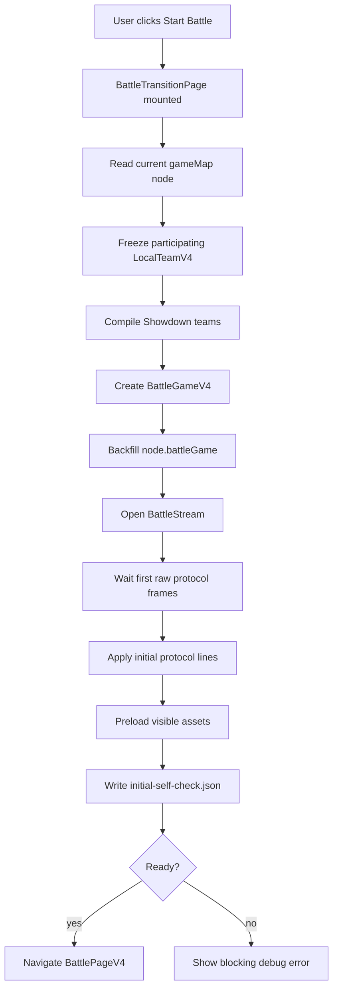
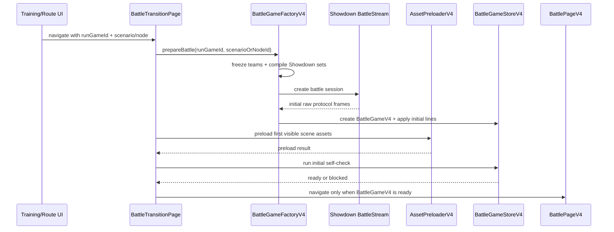
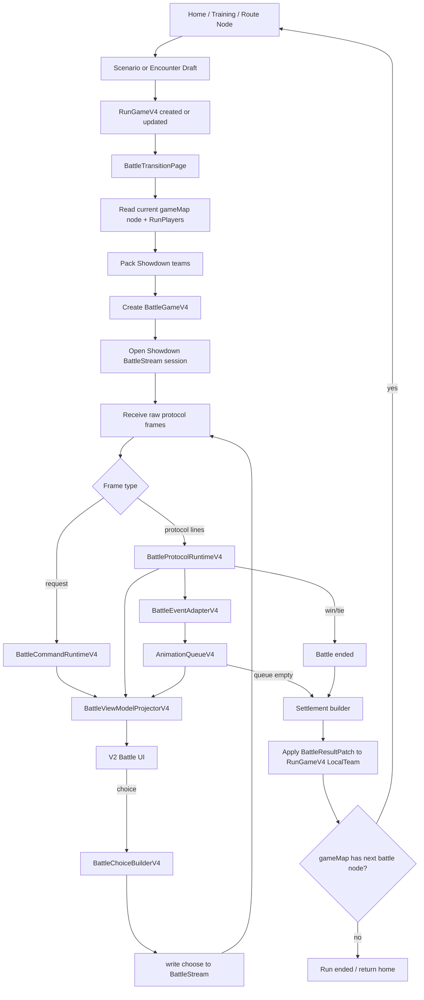
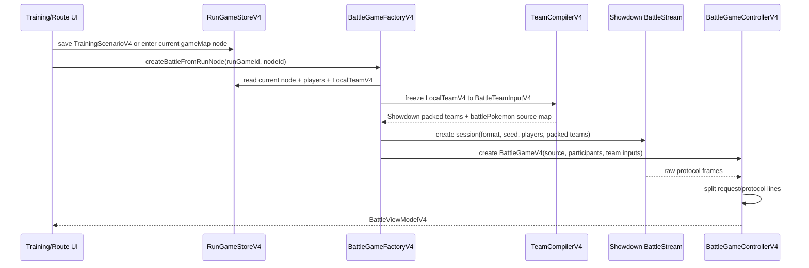
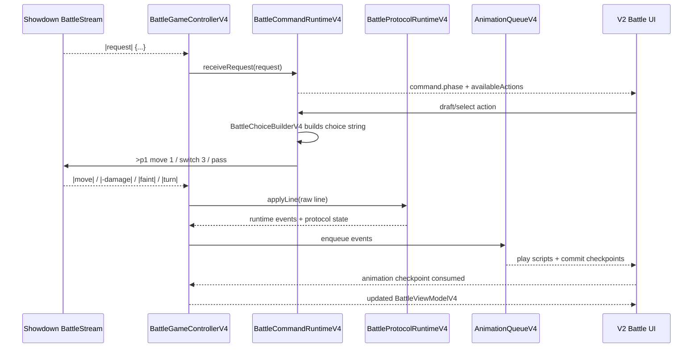
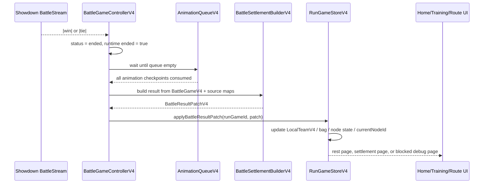

# Battle V4 架构计划：Showdown Protocol Runtime 优先

## Summary

Battle V4 的核心目标不是继续修补 V3，而是按 Pokemon Showdown 官方 client 的边界重建战斗内核：

```txt
Showdown raw protocol 是事实源
request 是指令 UI 源
animation queue 只表现事实变化
V2 战斗页 UI 继续复用
```

实施顺序固定为：

```txt
训练场测试优先
-> singles / doubles / multi 三模式稳定
-> 再接正式 GameRun 流程
```

训练场是 V4 第一入口，用来快速验证 Showdown 原始返回、协议解析、p1/p2/p3/p4、seat 映射、request/choice、主动换人、濒死强制换人、动画消费和状态展示。正式 GameRun 不在第一阶段接入，避免又把不稳定内核带进正式流程。

V4 不直接搬官方 `panel-battle.tsx` 页面。官方页面是 AGPL 且依赖 Pokemon Showdown 自己的房间、网络、Preact、全局状态。V4 只参考/局部移植官方 MIT 的 `battle-*.ts`、Showdown simulator 和 Showdown Dex：`BattleTextParser / BattleChoiceBuilder / BattleStream / Dex data / Dex search` 是优先复用对象。

本文档已迁移到 `changeBattleV2`。后续实现默认基于 V2 新项目边界：`apps/api` 放 Web/Desktop 共用应用函数，`packages/*` 放无 UI 依赖的核心包，旧 `changeBattle` 只作为参考来源，不作为运行时依赖。

官方资料统一放在工作区外部研究目录：

```txt
/home/alexqfmm/workPlace/pokemon/pokemonShowdownAbout/
  pokemonShowdown/       # server / simulator / data
  pokemonShowdownClient/ # official web client
  pokemonShowdownDex/    # dex.pokemonshowdown.com
```

## Core Architecture

```txt
Showdown BattleStream raw output
-> RawProtocolRecorder
-> ProtocolParser             # 优先复用官方 BattleTextParser
-> BattleProtocolRuntime
   -> p1/p2/p3/p4 side model
   -> active slot model
   -> pokemon model
   -> request model
-> BattleEventAdapter
-> AnimationQueue
-> ViewTeam Commit
-> V2 Battle UI
```

核心边界：

- `|request|...` 不进入动画队列，只更新 `CommandState`。
- `|move| / |switch| / |drag| / |replace| / |faint| / |-damage| / |-start| / |-end|` 进入 `BattleProtocolRuntime`。
- `BattleProtocolRuntime` 只接收 raw protocol，不读取 React UI 状态。
- `BattleEventAdapter` 只把 protocol fact 转成动画事件，不创造事实。
- `AnimationQueue` 只包含动画和 checkpoint commit，不包含 `showCommand`。
- `CommandPresenter` 只从 `request` 和 runtime state 生成 UI 可选操作。
- V2 UI 只读 `BattleViewModelV4`、播放动画、提交 choice，不参与身份判断。
- 正式流程、训练场、debug 最终都走同一个 V4 runtime；差异只在创建 GameRun/Player/Team 的入口。

## Official Reuse Strategy

官方资源分三档复用，避免再次凭空猜协议，同时避免把不适合的页面体系硬塞进项目。

### 直接复用

这些模块优先复制/封装到 `changeBattleV2` 的 battle/showdown adapter 层，并保留原始 license 注释：

- `pokemonShowdownClient/play.pokemonshowdown.com/src/battle-text-parser.ts`
  - 用于解析 raw protocol line 的 `args/kwArgs`。
  - V4 不再自己手写临时 parser，除非官方 parser 无法独立运行。
- `pokemonShowdownClient/play.pokemonshowdown.com/src/battle-choices.ts`
  - 用于参考或移植 request -> choice string 的构建规则。
  - 尤其是 doubles/multi 多选择、targetLoc、自动 pass、forceSwitch。
- `pokemonShowdown/data/*.ts`
  - `pokedex/moves/abilities/items/learnsets/typechart/aliases/formats-data` 是 Dex 事实源。
  - 后续技能动画绑定、图鉴搜索、合法招式、属性显示都应优先从这些数据派生。
- `pokemonShowdown/sim/teams.ts`
  - 用于 Showdown team pack/unpack 规则对照。

### 包装复用

这些资源可以作为独立工具或 iframe/webview/adapter 包装，不直接混入战斗 runtime：

- `pokemonShowdownDex/testclient.html`
  - 可作为完整图鉴工具入口。
  - 适合放到 debug / dex 页面作为“官方图鉴参考”打开。
- `pokemonShowdownDex/js/pokedex*.js`
  - 可研究其搜索、面板、详情展示逻辑。
  - 若要接入 React，需要抽数据和搜索逻辑，不直接搬 Backbone panel。
- `pokemonShowdown/sim/battle-stream.ts`
  - 训练场 raw debug 和自动 fixture 生成优先用 BattleStream。
  - Runtime 不直接依赖 Electron IPC；Electron/Web 只负责提供 raw input/output。

### 只参考不搬

这些模块不直接进入项目实现：

- `pokemonShowdownClient/play.pokemonshowdown.com/src/panel-battle.tsx`
  - AGPL 页面，强依赖官方房间系统、网络层、Preact、全局 `PS`。
  - 只参考它的边界：`request -> receiveRequest -> BattleChoiceBuilder`，其他 protocol line -> `battle.add`。
- `pokemonShowdownClient/play.pokemonshowdown.com/src/battle.ts`
  - 可参考 `Battle / Side / Pokemon` 建模和 p3/p4 multi 处理。
  - 不原样照搬完整类；官方为 replay 兼容存在名字匹配等 fallback，V4 红线禁止这些兜底。
- `pokemonShowdownDex/js/panels.js`
  - Backbone/jQuery 面板路由，不进入 React 主应用状态树。

建议新增 adapter 目录：

```txt
packages/showdown-battle-core/
  protocol/
    battle-text-parser.ts
    protocol-types.ts
  choices/
    battle-choice-builder.ts
  dex/
    load-showdown-dex-data.ts
    showdown-dex-search.ts
  debug/
    battlestream-fixture-runner.ts
```

`packages/showdown-battle-core` 只做官方资源适配，不放业务状态、不放 UI、不放 GameRun 逻辑。

## Showdown Client Battle Page Architecture To Imitate

V4 说“全面模仿 Showdown Client 战斗页架构”，不是复制官方 `panel-battle.tsx` 的 UI 页面，而是模仿它的职责拆分。官方 client 的关键链路可以概括为：

```txt
server room message
-> BattleRoom.receiveLine
   -> |request|: receiveRequest(request)
      -> BattleChoiceBuilder(request)
      -> render command controls
   -> other battle protocol line
      -> Battle.add(raw line)
      -> Battle / Side / Pokemon update
      -> BattleScene animation/log update
```

本项目 V4 对应关系：

| Showdown Client | V4 对应模块 | V4 规则 |
| --- | --- | --- |
| `BattleRoom` | `BattleGameControllerV4` | 接 raw frame、分发 request/protocol、驱动状态机，不放 UI 组件 |
| `receiveRequest` | `BattleCommandRuntimeV4.receiveRequest` | 只更新 command/request，不生成动画 |
| `BattleChoiceBuilder` | `BattleChoiceBuilderV4` | request -> choice string，支持 doubles/multi/pass/target |
| `Battle.add` | `BattleProtocolRuntimeV4.applyLine` | raw protocol -> protocol fact/runtime event |
| `Battle / Side / Pokemon` | `BattleProtocolStateV4` | p1/p2/p3/p4 side、active binding、team state |
| `BattleScene` | `BattleEventAdapterV4 + AnimationQueueV4` | 只表现 runtime event，不创造事实 |
| `panel-battle.tsx` controls | V2 战斗页 command UI | 只读 command state 和 view model，提交 choice |

V4 的核心抄法是：

```txt
request 与 protocol line 分流
choice builder 与 protocol runtime 分离
battle state 与 scene/UI 分离
scene/animation 只能消费 battle state diff
```

不能抄的是：

- 不抄官方房间系统、聊天、网络层、Preact 页面和全局 `PS`。
- 不直接复制 AGPL `panel-battle.tsx` 页面。
- 不保留官方 replay 兼容里可能存在的名字兜底到 V4 事实层。
- 不让 React UI 拥有 active 身份判断权。

V4 自己的战斗页分层固定为：

```txt
BattleGameControllerV4
  receives raw Showdown frames
  owns BattleGameV4 aggregate

BattleProtocolRuntimeV4
  owns protocol facts
  consumes all non-request battle lines

BattleCommandRuntimeV4
  owns current request and choice draft
  consumes only |request| JSON

BattleEventAdapterV4
  maps protocol runtime events to animation scripts

BattleViewModelProjectorV4
  projects protocol/view/command/debug into V2 UI shape

V2 Battle UI
  renders scene + command panel
  submits user choice
  never mutates facts
```

## Object Structure

### Showdown Identity

```ts
type ShowdownPlayerId = "p1" | "p2" | "p3" | "p4";
type ShowdownSlot = "a" | "b" | "c" | "d" | "e" | "f";
type ShowdownActiveId = `${ShowdownPlayerId}${ShowdownSlot}`;

type BattleV4Mode = "singles" | "doubles" | "multi";
type BattleV4Source = "training" | "official" | "debug";
type BattleV4GameType = "singles" | "doubles" | "multi" | "freeforall" | "triples";

type BattleV4SeatId =
  | "nearA"
  | "nearB"
  | "farA"
  | "farB";
```

V4 必须明确区分四种身份：

- `ShowdownPlayerId`：Showdown 玩家位，`p1/p2/p3/p4`。
- `ShowdownActiveId`：Showdown 场上位，`p1a/p1b/p3b` 等。
- `BattlePokemonId`：本场战斗内宝可梦实体 ID。
- `BattleV4SeatId`：我方 UI 展示座位，`nearA/nearB/farA/farB`。

`showdownIdentityToken` 继续用于长期回写和 pokeball 承载，但它不是 Showdown active ident，也不能用来替代 `p1a/p2a/p3b`。

### BattleGameV4

```ts
type BattleGameV4 = {
  id: string;
  source: BattleV4Source;
  mode: BattleV4Mode;
  status:
    | "creating"
    | "opening"
    | "running"
    | "waitingInput"
    | "animating"
    | "ended"
    | "blocked";

  showdown: {
    sessionId: string;
    formatId: string;
    gameType: BattleV4GameType;
    seed: string | number[];
    rawProtocol: ShowdownRawFrame[];
    currentRequest: ShowdownRequestState | null;
    lastError?: BattleV4InvariantError;
  };

  participants: Record<ShowdownPlayerId, BattleV4Participant>;
  teams: Record<ShowdownPlayerId, BattlePokemonV4[]>;
  protocol: BattleProtocolStateV4;
  view: BattleViewStateV4;
  animation: BattleAnimationStateV4;
  command: BattleCommandStateV4;
  debug: BattleV4DebugState;
};
```

### Participant

```ts
type BattleV4Participant = {
  playerId: ShowdownPlayerId;
  gamePlayerId: string;
  controller: "local" | "ai" | "remote" | "script";
  alliance: "near" | "far";
  allyPlayerIds: ShowdownPlayerId[];
  foePlayerIds: ShowdownPlayerId[];
};
```

默认控制关系：

- 训练场 singles/doubles：`p1 = local`，`p2 = ai`。
- 训练场 multi/co-op：`p1 = local`，`p3 = ai/script ally`，`p2/p4 = ai enemy`。
- 后续正式合作双打可按 GameRun player/controller 分配覆盖默认值。

### BattlePokemonV4

```ts
type BattlePokemonV4 = {
  battlePokemonId: string;
  sourcePokemonId: string;
  ownerPlayerId: ShowdownPlayerId;
  teamIndex: number;
  showdownIdentityToken: string;

  ident: string;
  details: string;
  condition: string;
  hp: number | null;
  maxHp: number | null;
  status: string;
  moves: BattleMoveView[];
  fainted: boolean;

  volatileFlags: {
    substitute?: boolean;
    transformed?: boolean;
    terastallized?: boolean;
    dynamaxed?: boolean;
    illusioned?: boolean;
  };
};
```

规则：

- `ident` 来自 Showdown，例如 `p1: Pikachu`。
- active 变化只由 `switch/drag/replace` 写入。
- `faint` 只写 `fainted/hp/status`，不清空 active，不清空 UI seat。
- `Substitute/Transform/Terastal/Dynamax/Illusion` 是视觉/volatile flag，不改长期 identity。

### Protocol State

```ts
type BattleProtocolStateV4 = {
  sides: Record<ShowdownPlayerId, {
    playerId: ShowdownPlayerId;
    name: string;
    active: (BattlePokemonRef | null)[];
    team: BattlePokemonRef[];
  }>;

  activeBindings: Partial<Record<ShowdownActiveId, {
    activeId: ShowdownActiveId;
    playerId: ShowdownPlayerId;
    slotIndex: number;
    battlePokemonId: string;
    uiSeatId: BattleV4SeatId;
  }>>;

  uiSeatMap: Record<BattleV4SeatId, ShowdownActiveId | null>;
};
```

Seat 映射默认规则：

- singles：`p1a -> nearA`，`p2a -> farA`。
- doubles：`p1a -> nearA`，`p1b -> nearB`，`p2a -> farA`，`p2b -> farB`。
- multi/co-op：`p1a -> nearA`，`p3b -> nearB`，`p2a -> farA`，`p4b -> farB`。

如果 raw protocol fixture 证明 multi slot 不同，必须以 raw protocol 修正规则，不能用 UI 现象猜。

### Command State

```ts
type BattleCommandStateV4 = {
  phase: "none" | "team" | "move" | "switch" | "wait";
  request: ShowdownRequestState | null;
  actingPlayerId: ShowdownPlayerId | null;
  choicesDraft: string[];
  availableActions: BattleV4Action[];
};
```

规则：

- `requestType = move`：从 `request.active` 生成招式和目标选择。
- `requestType = switch`：从 `request.forceSwitch` 和 `request.side.pokemon` 生成强制换人选择。
- `requestType = team`：生成队伍预览选择。
- `requestType = wait`：不显示本地 command。
- 自动 `pass` 只在 choice layer 处理，不进入动画队列。
- AI/NPC 只在队列空、runtime 不在 animating、且 command 判断对应 player 非 local 时提交选择。

### Runtime Event

```ts
type BattleV4RuntimeEvent =
  | {type: "move"; user: ShowdownActiveId; target: ShowdownActiveId | null; move: string}
  | {type: "damage"; target: ShowdownActiveId; condition: string}
  | {type: "heal"; target: ShowdownActiveId; condition: string}
  | {type: "status"; target: ShowdownActiveId; status: string}
  | {type: "volatileStart"; target: ShowdownActiveId; volatile: string}
  | {type: "volatileEnd"; target: ShowdownActiveId; volatile: string}
  | {type: "switch" | "drag" | "replace"; activeId: ShowdownActiveId; pokemon: BattlePokemonRef}
  | {type: "faint"; target: ShowdownActiveId}
  | {type: "fieldEffect" | "sideEffect"; effect: string; active: boolean}
  | {type: "turn"; turn: number}
  | {type: "end"; winner: ShowdownPlayerId | null};
```

Runtime event 是动画 adapter 的输入，不是 UI 事实源。事实源仍是 `BattleProtocolStateV4`。

## RunGame / BattleGame / LocalTeam Design

V4 需要明确两层游戏对象：

```txt
RunGameV4：一次游玩流程 / 一次训练场场景 / 一次正式 roguelike run
BattleGameV4：RunGame 里的某一场 Showdown battle
```

`RunGameV4` 是长期上下文，负责保存玩家、队伍、背包、训练场配置、正式流程进度、流程节点、战后奖励和连续战斗状态。`BattleGameV4` 是短期上下文，只负责一场战斗内的协议、动画、指令、debug。一个 `RunGameV4` 可以按 `gameMap` 顺序创建多个 `BattleGameV4`，比如训练场连续试两场、正式流程连续遇敌、车轮战下一名敌人上场、失败后进入结算。

核心共识：

```txt
创建 RunGame 时：
  所有 RunPlayerV4 先实例化
  每个 Player 的 localTeam / bag 先实例化
  gameMap 节点顺序、对手、模式、规则全部确定
  每个节点的 battleGame 初始为 null

进入某个 battle 节点时：
  中转页读取 currentNode + run.players
  创建 BattleGameV4
  回填 currentNode.battleGame
  currentNode.state = running
```

也就是说，`RunGameV4` 创建时确定“路线和每一局怎么打”，但不提前创建 Showdown BattleStream、protocol runtime、动画队列这些重对象。`BattleGameV4` 只在进入当前节点前创建。

### Top Level Aggregate

```ts
type RunGameV4 = {
  id: string;
  source: "training" | "official" | "debug";
  status:
    | "creating"
    | "editing"
    | "resting"
    | "battlePreparing"
    | "battling"
    | "settling"
    | "ended"
    | "blocked";

  players: Record<ShowdownPlayerId, RunPlayerV4>;
  currentNodeId: string | null;
  gameMap: RunGameNodeV4[];

  training?: TrainingScenarioV4;
  official?: OfficialRunStateV4;
  result: RunGameResultV4 | null;
  debug: RunGameDebugStateV4;
};
```

`RunGameV4` 可以在当前节点里持有当前 `BattleGameV4`，但 `gameMap` 创建时所有 `battleGame` 必须为 `null`。训练场第一阶段每个 run 最多 1-2 场，可以直接把完整 `BattleGameV4` 回填到当前节点，方便 debug；后续如果对象太重，再拆成 `activeBattleGame + gameMap[].battleGameRef`。

### Run Player

```ts
type RunPlayerV4 = {
  playerId: ShowdownPlayerId;
  profileId: string;
  name: string;
  avatar: string;
  controller: "local" | "ai" | "remote" | "script";
  alliance: "near" | "far";

  localTeam: LocalTeamV4;
  bag: BagStateV4;
};
```

训练场里 `p1/p3/p2/p4` 都可以是 `RunPlayerV4`。区别只在 controller 和 alliance：

- singles：`p1 local near`，`p2 ai far`。
- doubles：`p1 local near`，`p2 ai far`，每边一名 player 但各自两个 active。
- multi/co-op：`p1 local near`，`p3 ai/script near`，`p2 ai far`，`p4 ai far`。

multi 不能把 `p3` 合并进 `p1`，也不能把 `p4` 合并进 `p2`。Showdown 的四个 player side 必须保留到 runtime。

### Game Map Node

`gameMap` 是 RunGame 的流程表。训练场第一版只需要 `battle` 节点；正式 roguelike 后续可以扩展 `rest/shop/event/reward`，但战斗流程先按 battle 节点跑通。

```ts
type RunGameNodeV4 = {
  id: string;
  index: number;
  kind: "battle";

  state:
    | "locked"       // 还没轮到
    | "ready"        // 当前可进入
    | "preparing"    // 中转页正在创建 BattleGame
    | "running"      // BattleGame 正在跑
    | "won"
    | "lost"
    | "skipped"
    | "blocked";

  p1: ShowdownPlayerId | null;
  p2: ShowdownPlayerId | null;
  p3: ShowdownPlayerId | null;
  p4: ShowdownPlayerId | null;

  mode: BattleV4Mode;
  ruleSet: BattleRuleSetV4;
  seed: string | number[];

  battleGame: BattleGameV4 | null;

  createdAt?: string;
  startedAt?: string;
  endedAt?: string;
};
```

节点里的 `p1/p2/p3/p4` 是 `run.players` 的引用，不是 Player 副本：

```txt
node.p1 = "p1"
run.players[node.p1] = 真正的 RunPlayerV4
```

这样战斗结束后 patch 回 `run.players.p1.localTeam`，下一场天然继承状态。`gameMap` 节点不得复制长期 Player、LocalTeam、bag 状态，除非后续明确设计“固定快照挑战”节点。

### Game Map Creation Examples

训练场单打两场：

```ts
type ExampleSingleTrainingRun = {
  players: {
    p1: RunPlayerV4; // local near
    p2: RunPlayerV4; // enemy A
    p3: RunPlayerV4; // optional unused/ally placeholder
    p4: RunPlayerV4; // enemy B
  };
  currentNodeId: "battle-1";
  gameMap: [
    {
      id: "battle-1";
      index: 0;
      kind: "battle";
      state: "ready";
      p1: "p1";
      p2: "p2";
      p3: null;
      p4: null;
      mode: "singles";
      ruleSet: "gen9-tera";
      battleGame: null;
    },
    {
      id: "battle-2";
      index: 1;
      kind: "battle";
      state: "locked";
      p1: "p1";
      p2: "p4";
      p3: null;
      p4: null;
      mode: "singles";
      ruleSet: "gen9-tera";
      battleGame: null;
    },
  ];
};
```

训练场合作：

```ts
type ExampleCoopTrainingNode = {
  id: "battle-1";
  state: "ready";
  p1: "p1"; // local near
  p3: "p3"; // ally near
  p2: "p2"; // enemy far
  p4: "p4"; // enemy far
  mode: "multi";
  ruleSet: "gen9-tera";
  battleGame: null;
};
```

### BattleGame Creation Policy

`battleGame` 初始值固定为 `null`：

```txt
RunGame created
-> gameMap[].battleGame = null
```

只有当前节点进入中转页时才能创建：

```txt
currentNode.state === ready
currentNode.battleGame === null
-> BattleTransitionPage / BattleGameFactoryV4
-> createBattleGameFromRunNode(runGame, currentNode)
-> currentNode.battleGame = battleGame
-> currentNode.state = running
-> runGame.status = battling
```

禁止为所有 `gameMap` 节点提前创建 BattleGame。提前创建会导致 Showdown session、raw protocol、request、动画队列、source map 和长期队伍状态过早分叉。

### Post Battle Route Decision

战斗结束后，中转页或 RunGame controller 只做一个纯判断：

```txt
BattleGame ended
-> animation queue consumed
-> build BattleResultPatchV4
-> apply patch to run.players[pX].localTeam / bag
-> currentNode.state = won/lost/blocked
-> currentNode.battleGame.status = ended/blocked
-> decide next route
```

判断规则：

```ts
type RunGameRouteDecisionV4 =
  | {route: "rest"; nextNodeId: string; reason: "next-battle"}
  | {route: "settlement"; outcome: "win"; reason: "all-battles-won"}
  | {route: "settlement"; outcome: "loss"; reason: "battle-lost" | "battle-blocked" | "abandoned"};

function resolvePostBattleRoute(run: RunGameV4, node: RunGameNodeV4): RunGameRouteDecisionV4 {
  if (node.state === "lost") return {route: "settlement", outcome: "loss", reason: "battle-lost"};
  if (node.state === "blocked") return {route: "settlement", outcome: "loss", reason: "battle-blocked"};

  const next = run.gameMap.find(entry => entry.index > node.index && entry.kind === "battle" && entry.state === "locked");
  if (!next) return {route: "settlement", outcome: "win", reason: "all-battles-won"};

  return {route: "rest", nextNodeId: next.id, reason: "next-battle"};
}
```

流程语义：

```txt
是否胜利？
  否 -> 结算页（失败）
  是 -> 是否所有小场全部结束？
        是 -> 结算页（胜利）
        否 -> 解锁下一 node -> 休整页
```

## Roguelike / Wheel Battle Requirements

最终目标是宝可梦培养 + 车轮战 roguelike，所以 V4 一开始就要避免“打一场就结束”的对象设计。

### Run Scope vs Battle Scope

| 数据 | 所属层 | 持久性 | 说明 |
| --- | --- | --- | --- |
| 流程节点、关卡序列、随机种子 | `RunGameV4.gameMap` | 整个 run | 决定每一小场打谁、规则是什么、当前走到哪 |
| 正式路线草稿、地图分支 | `OfficialRunStateV4` | 整个 run | 正式 roguelike 可用它生成或更新 `gameMap` |
| 玩家长期队伍、背包、临时 buff | `RunGameV4.players` | 整个 run | 多场 battle 之间延续 |
| 当前敌人和队伍 | `RunGameV4.players` + `gameMap` 引用 | 整个 run | 创建 RunGame 时先确定，BattleGame 进入节点时再读取 |
| raw protocol、request、active binding | `BattleGameV4` | 单场 battle | 战斗结束后归档 debug |
| HP/status/经验/道具消耗写回 | `BattleResultPatchV4` | 战后一次性应用 | 不允许战斗中直接改 RunGame |

### Official Route Draft Shape

```ts
type RoguelikeRouteStateV4 = {
  seed: string | number[];
  currentNodeId: string;
  nodes: Record<string, RoguelikeNodeV4>;
  completedNodeIds: string[];
  pendingRewardIds: string[];
  runModifiers: RunModifierV4[];
};

type RoguelikeNodeV4 = {
  id: string;
  type: "battle" | "elite" | "boss" | "rest" | "shop" | "event" | "reward";
  encounter?: EncounterDraftV4;
  nextNodeIds: string[];
};
```

训练场第一版不做路线 UI，直接生成 `gameMap`。正式 roguelike 后续可以先生成 `RoguelikeRouteStateV4` 或地图草稿，再把玩家选择过的路线节点落成 `RunGameV4.gameMap`。无论来源是训练场还是正式路线，进入战斗时都只认 `currentNodeId + gameMap + run.players`。

### Wheel Battle Shape

车轮战不要设计成“一场 BattleGame 里强行塞多波敌人”。默认设计是：

```txt
RunGameV4
  -> BattleGameV4 #1 enemy wave A
  -> settlement patch
  -> optional reward/rest/shop decision
  -> BattleGameV4 #2 enemy wave B
  -> settlement patch
  -> ...
```

也就是说，车轮战是 `RunGameV4` 连续创建多个 `BattleGameV4`。每一场仍然是标准 Showdown battle，这样 protocol runtime 不需要理解“第几波敌人”。如果未来要做“同一场内增援”，那也必须先确认 Showdown protocol 是否能自然表达；不能在 UI 层假装换一批敌人。

### Persistence Policy

不同模式使用同一套 patch 机制，但应用策略不同：

| 模式 | HP/status 写回 | 经验/成长 | 道具消耗 | 用途 |
| --- | --- | --- | --- | --- |
| `training` | 默认不写回，可手动保存结果 | 默认不写回 | 默认不写回 | 快速验证流程 |
| `debug` | 不写回 | 不写回 | 不写回 | 重放/排错 |
| `official` | 写回 | 写回 | 写回 | 正式 roguelike run |

红线：训练场为了测试可以“看起来连续”，但不能绕过 `BattleResultPatchV4` 直接改 `LocalTeamV4`。

## LocalTeam Lifecycle

V1 的 `localTeam / showdownTeam / runtimeTeam / viewTeam` 不应该继续由训练页同时维护。V4 改成单源派生：

```txt
LocalTeamV4        # RunGame 长期队伍，战斗前后唯一需要回写的队伍源
-> BattleTeamInput # 创建 BattleGame 时的一次性输入快照
-> ShowdownTeam    # pack 给 Showdown BattleStream 的队伍格式
-> BattlePokemonV4 # 战斗内实体，由 protocol runtime 维护
-> BattleViewModel # UI 投影，不回写 LocalTeam
```

### LocalTeamV4

`LocalTeamV4` 是非战斗态队伍，训练页和正式流程都编辑它。它可以保存项目自己的字段，但不能保存 Showdown active ident。

```ts
type LocalTeamV4 = {
  id: string;
  name: string;
  pokemon: LocalPokemonV4[];
};

type LocalPokemonV4 = {
  localPokemonId: string;
  speciesId: string;
  nickname?: string;
  level: number;
  gender?: "M" | "F" | "N";
  shiny?: boolean;
  itemId?: string;
  abilityId?: string;
  nature: string;
  moves: string[];
  evs: StatTable;
  ivs: StatTable;

  experience?: number;
  friendship?: number;
  persistentHp?: number;
  persistentStatus?: string | null;
};
```

### BattleTeamInput

创建战斗时从 `LocalTeamV4` 冻结出快照，避免战斗中训练页继续编辑导致状态漂移。

```ts
type BattleTeamInputV4 = {
  playerId: ShowdownPlayerId;
  sourceTeamId: string;
  pokemon: BattlePokemonInputV4[];
};

type BattlePokemonInputV4 = {
  localPokemonId: string;
  teamIndex: number;
  set: PokemonSetDraftV4;
  showdownSet: ShowdownPackedSetV4;
  showdownIdentityToken: string;
};
```

### Pokeball / Showdown ID Mapping

使用 pokeball 携带唯一 ID 映射成 `showdownIdentityToken` 的方案继续保留，而且应该成为 V4 的标准 source map。它解决的是“这只长期宝可梦进入 Showdown 后，战后怎么准确回写到 LocalTeam”的问题。

固定链路：

```txt
LocalPokemonV4.localPokemonId
-> TeamCompilerV4 writes showdownIdentityToken into Showdown set metadata / pokeball marker
-> BattleTeamInputV4 records localPokemonId + showdownIdentityToken
-> BattleGameV4 creates BattlePokemonV4
-> protocol runtime attaches switch/drag/replace confirmed Pokemon to BattlePokemonV4
-> BattleSettlementBuilderV4 uses localPokemonId/showdownIdentityToken source map for writeback
```

建议字段：

```ts
type PokemonSourceMapV4 = {
  playerId: ShowdownPlayerId;
  localTeamId: string;
  localPokemonId: string;
  teamIndex: number;
  showdownIdentityToken: string;
  battlePokemonId: string;
};
```

生成规则：

- `showdownIdentityToken` 在创建 `BattleTeamInputV4` 时生成或复用。
- 同一个 `RunGameV4` 内，同一只 `LocalPokemonV4` 的 token 应该稳定，方便连续战斗追踪。
- token 必须写入 Showdown team 中 V4 可回读的位置；V1 使用 pokeball 的做法可以保留。
- token 不能依赖中文名、昵称、物种名、图片名或队伍顺序。

使用边界：

| 可以用 `showdownIdentityToken` 做什么 | 不能用 `showdownIdentityToken` 做什么 |
| --- | --- |
| 战斗创建时建立 `localPokemonId -> battlePokemonId` source map | 替代 `p1a/p2b` 判断场上目标 |
| 战后把 HP/status/经验/奖励回写到 `LocalTeamV4` | 在 `move/damage/faint` 事件中猜 seat |
| debug 里确认某个 BattlePokemon 来自哪只长期宝可梦 | 从 request.active 顺序推导 active binding |
| 多场车轮战中追踪同一只长期宝可梦 | 没有 `switch/drag/replace` 时切换模型 |

一句话：`showdownIdentityToken` 是长期身份，`ShowdownActiveId` 是场上位置。V4 允许长期身份帮助回写，但所有动画目标、seat、active binding 必须以 protocol ident 为准。

### 战斗内不再维护三份队伍

V4 战斗页内部只允许三类状态：

| 状态 | 归属 | 生命周期 | 是否回写 LocalTeam |
| --- | --- | --- | --- |
| `BattlePokemonV4` | `BattleGameV4.teams` | 一场战斗 | 只在结算阶段生成 patch |
| `BattleProtocolStateV4` | `BattleProtocolRuntimeV4` | 一场战斗 | 不直接回写 |
| `BattleViewModelV4` | projector 输出 | 可随时重算 | 不回写 |

也就是说，`showdownTeam` 是创建时产物，`runtimeTeam` 是 `BattlePokemonV4 + protocol`，`viewTeam` 是投影结果。训练页不维护 `runtimeTeam/viewTeam`，战斗页不直接改 `LocalTeam`。

## RunGame To BattleGame Flow

## Transition Page / Battle Loading Stage

中转页是 V4 必须保留的独立阶段。它不是单纯的 loading 画面，而是用来承接重任务、降低玩家卡顿感、并把错误挡在战斗页之外的 `BattlePreparationStageV4`。

固定入口：

```txt
训练页 / 路线节点 / 正式遭遇
-> 中转页 BattleTransitionPage
-> 战斗页 BattlePageV4
```

中转页负责做这些重任务：

| 任务 | 说明 |
| --- | --- |
| 冻结队伍 | 从 `LocalTeamV4` 生成 `BattleTeamInputV4`，建立 `PokemonSourceMapV4` |
| 编译 Showdown team | pack 队伍、写入 pokeball/showdownIdentityToken、校验招式/特性/道具 |
| 创建 BattleGame | 生成 `BattleGameV4`、participants、初始 debug 目录 |
| 启动 BattleStream | 创建 Showdown session，写入 players/teams/rules/seed |
| 首帧协议检查 | 等到 start/player/poke/switch/request 等关键 raw protocol 到达 |
| 资源预热 | 预加载场地背景、BGM、出场宝可梦立绘、小图、招式音效/特效索引 |
| Debug 自检 | 输出 `initial-self-check.json`，检查 p1/p2/p3/p4、seat map、source map |
| 错误阻断 | 编译失败、protocol 缺关键字段、资源严重缺失时停在中转页，不进入战斗页 |

中转页状态建议：

```ts
type BattlePreparationStateV4 = {
  runGameId: string;
  battleId: string | null;
  source: BattleV4Source;
  phase:
    | "freezingTeam"
    | "compilingTeam"
    | "creatingBattle"
    | "openingStream"
    | "waitingFirstProtocol"
    | "preloadingAssets"
    | "selfChecking"
    | "ready"
    | "failed";
  progress: number;
  currentLabel: string;
  warnings: BattlePreparationWarningV4[];
  error?: BattleV4InvariantError;
};
```

### Transition Page Flow



### Sequence Diagram: Transition To Battle Page



### UX Rules

- 训练页点击开始后立即进入中转页，避免用户误以为按钮没反应。
- Web/Desktop 的页面路由不等于 `gameMap` 节点。正常 V2 训练流程应保持简洁：`首页 -> 训练配置页 -> 进入休整区中转页 -> 休整页`。`/training/transition` 只作为旧入口兼容或冷启动初始化，不作为玩家主路径；`gameMap` 只记录已经固化的对局节点，不把配置页、读图页、休整页塞成流程节点。
- 中转页要显示当前阶段，比如“编译队伍 / 连接 Showdown / 预加载立绘 / 检查 seat”。
- 中转页可以展示提示、玩家头像、对战双方、模式和规则，但不能展示伪造的场上状态。
- 战斗页只接收 ready 的 `battleId`；不在战斗页里做队伍 pack、BattleStream 首帧等待、首屏资源批量加载。
- 如果失败，中转页显示可复制/导出的 debug 信息和 raw self-check，不让玩家进入半初始化战斗页。

### Performance Rules

- 重 CPU/IO 任务优先放中转页：team compile、Dex 校验、Showdown session 创建、debug 文件初始化、首屏资源预加载。
- 战斗页只做轻量订阅和渲染，不做大规模同步计算。
- 首帧必须预加载：当前背景、BGM、双方 active 宝可梦 front/back/icon、HP 卡资源、command 面板依赖图标。
- 后续队伍替补、招式特效、叫声可以分批 lazy preload，不能阻塞进入战斗。
- 中转页预热失败分等级：关键资源失败可 blocked；非关键图片失败只 warning 并使用 fallback。

### Flow Chart



### Sequence Diagram: Enter Battle



进入战斗页时延续的不是 `viewTeam`，而是 `LocalTeamV4` 的冻结快照和 `localPokemonId -> battlePokemonId` 映射。战斗页第一帧显示什么，必须等 Showdown protocol 的 `switch/drag/replace` 或开局出场 line 确认。

### Sequence Diagram: Choice And Animation



这里 `request` 只负责让 UI 知道能点什么。伤害、濒死、换人、替身、状态都必须等 protocol line 到达后再展示和 commit。

### Sequence Diagram: Battle End And LocalTeam Writeback



写回只能发生一次，并且必须满足两个条件：

```txt
runtime 收到 end/win/tie
animation queue 已消费完
```

如果 protocol 已结束但动画还没播完，不能提前回首页；如果动画播完但 runtime 没结束，不能结算。

## Battle Result Writeback

V4 战斗结束不允许战斗页到处直接改 `LocalTeam`，统一产出 patch：

```ts
type BattleResultPatchV4 = {
  battleId: string;
  runGameId: string;
  outcome: "win" | "lose" | "tie" | "forfeit" | "blocked";
  winnerPlayerIds: ShowdownPlayerId[];

  pokemonPatches: Array<{
    playerId: ShowdownPlayerId;
    localPokemonId: string;
    hp?: number;
    status?: string | null;
    experienceDelta?: number;
    friendshipDelta?: number;
  }>;

  bagPatches: Array<{
    playerId: ShowdownPlayerId;
    itemId: string;
    delta: number;
  }>;

  rewardPatches: Array<RunRewardPatchV4>;
  routePatch?: RunRoutePatchV4;
  debugFolder?: string;
};
```

训练场第一版可以选择不写回 HP/status，只记录 battle summary；正式流程再打开持久 HP、经验、道具消耗。无论训练场还是正式流程，都必须通过同一个 `BattleSettlementBuilderV4` 产出 patch，只是 patch 内容可以为空。

### Writeback Rules

- `LocalTeamV4` 只在 `applyBattleResultPatch` 中改变。
- `BattleGameV4` 内部不能保存 `LocalTeamV4` 引用，只保存 source map。
- `BattlePokemonV4.localPokemonId` 只用于结束回写，不用于 active target 解析。
- `faint` 后是否持久化为 0 HP，由 run mode 决定；protocol runtime 只记录战斗事实。
- 训练场默认不污染用户长期资料；需要“保存训练结果”时再显式应用 patch。
- 正式流程必须写回道具消耗、HP/status、经验、奖励、路线进度，但只能在结算阶段写一次。

## Training Scenario V4

训练页的职责是创建一个可重复的 battle scenario，而不是预先造战斗 runtime。

更准确地说，训练页是 `BattleGameV4` 的快速验证台：

```txt
训练页不等于正式 roguelike 玩法
训练页负责快速构造 BattleGameV4 输入
训练页负责暴露 debug 面板和极端 case
训练页用来证明 battle core 能打完、能解释、能复现
```

所以训练页第一优先级不是做奖励、地图、养成、剧情，而是让我们能用最少点击验证：

- singles/doubles/multi 的 player/seat 是否正确。
- `standard/gen7/gen8/gen9` 的 request/choice 是否正确。
- 自定义队伍能否正确 pack 给 Showdown。
- raw protocol 能否完整展示和导出。
- runtime state、activeBindings、uiSeatMap 是否符合预期。
- animation queue 是否只消费 protocol fact。
- 战斗结束是否能产出 `BattleResultPatchV4`，即使训练模式默认不应用 patch。

```ts
type TrainingModeV4 = "singles" | "doubles" | "multi";
type BattleRuleSetV4 = "standard" | "gen7-mega-z" | "gen8-dynamax" | "gen9-tera";

type TrainingScenarioV4 = {
  id: string;
  name: string;
  mode: TrainingModeV4;
  ruleSet: BattleRuleSetV4;
  formatId: string;
  seed?: string | number[];
  players: TrainingPlayerDraftV4[];
};

type TrainingPlayerDraftV4 = {
  playerId: ShowdownPlayerId;
  name: string;
  avatar: string;
  controller: "local" | "ai" | "script";
  alliance: "near" | "far";
  team: LocalTeamV4;
  bag: BagStateV4;
};
```

训练页可以展示和编辑队伍、头像、规则、AI 控制，并在点击开始时创建 `RunGameV4.players` 和 `RunGameV4.gameMap`。`gameMap` 里每个节点会确定 p1/p2/p3/p4、模式、规则、seed 和顺序，但 `battleGame` 必须保持 `null`，直到该节点进入中转页。

训练页不能生成：

- `BattleProtocolStateV4`
- `activeBindings`
- `BattleViewModelV4`
- `AnimationQueueV4`
- `viewTeam`
- `BattleGameV4`

这些只能由创建战斗后的 `BattleGameV4` 和 raw protocol 产生。

### Training Mode Mapping

| Training mode | Showdown format/game type | Players | UI seats |
| --- | --- | --- | --- |
| `singles` | singles format | `p1` vs `p2` | `p1a nearA`, `p2a farA` |
| `doubles` | doubles format | `p1` vs `p2` | `p1a nearA`, `p1b nearB`, `p2a farA`, `p2b farB` |
| `multi` | multi battle format | `p1+p3` vs `p2+p4` | `p1a nearA`, `p3b nearB`, `p2a farA`, `p4b farB` 初始假设，以 fixture 校准 |

特殊系统不是 UI flag，而是 Showdown format/ruleset 的一部分：

| Rule set | Meaning | Showdown/V4 handling |
| --- | --- | --- |
| `standard` | 无 Mega/Z/极巨/太晶特殊系统 | 选择普通 format 或禁用对应 mechanics |
| `gen7-mega-z` | Mega + Z 招式 | choice layer 展示 mega/z 选项，protocol runtime 等 Showdown fact |
| `gen8-dynamax` | 极巨化 | choice layer 展示 dynamax 选项，visual flags 等 protocol |
| `gen9-tera` | 太晶化 | choice layer 展示 tera 选项，visual flags 等 protocol |

训练页不直接决定某只宝可梦“已经 Mega/极巨/太晶”。它只决定 format/ruleset 和可选配置，真正发生与否由 choice 和 protocol 确认。

## Red Lines

这些是 V4 硬红线，违反就是 bug：

- 严禁从中文文本、日志描述、名字、物种、图片、HP、速度顺序反推身份或目标。
- 严禁把 `request` 当动画指令。
- 严禁动画队列里出现 `showCommand`。
- 严禁用 `request.active[index]` 直接决定 UI seat。
- 严禁用 `request` 的 active 变化 synthetic commit seat。
- 严禁没有 `switch/drag/replace` 就切换模型或 active binding。
- 严禁在 `faint` 时清空 seat；只有 `switch/drag/replace` 能改变 active binding。
- 严禁把 `p3/p4` 压扁进 `p1/p2`；multi 必须建四个 player side。
- 严禁加“唯一匹配所以兜底”的逻辑。
- 严禁缺 ident、缺 seat、缺 target 时继续猜；必须 blocked 并导出 raw trace。
- 严禁前端修改事实状态；前端只提交 choice、播放动画、触发 commit checkpoint。
- 严禁为了兼容 V3 旧路径保留双数据源；V4 战斗页只读 V4 runtime/view。
- 严禁先接正式流程再验证训练场；训练场三模式不稳，不进入正式 GameRun 接入。
- 严禁 `gameMap` 节点复制长期 Player/LocalTeam/bag 状态；节点只能引用 `run.players`。
- 严禁创建 `RunGameV4` 时提前创建所有 `BattleGameV4`；`gameMap[].battleGame` 初始必须是 `null`。
- 严禁非当前节点创建或回填 `battleGame`；只有中转页/Factory 进入当前 ready 节点时可以创建。
- 严禁 BattleGame 战斗中直接修改 `RunGameV4.players`；只能在结算阶段通过 `BattleResultPatchV4` 回写。

## Implementation Phases

### Phase 0：文档与官方对照

目标：把 V4 的协议事实和官方 client 对照固定下来。

产出：

- `docs/showdown-sim-protocol.zh-CN.md`：官方 SIM-PROTOCOL 中文注释版。
- `docs/showdown-client-battle-architecture-notes.md`：官方 client battle 架构笔记。
- `plan/battle-v4-architecture-plan.md`：本文档。
- 官方研究目录索引：
  - `/home/alexqfmm/workPlace/pokemon/pokemonShowdownAbout/pokemonShowdown/sim/SIM-PROTOCOL.md`
  - `/home/alexqfmm/workPlace/pokemon/pokemonShowdownAbout/pokemonShowdown/sim/battle-stream.ts`
  - `/home/alexqfmm/workPlace/pokemon/pokemonShowdownAbout/pokemonShowdownClient/play.pokemonshowdown.com/src/battle-text-parser.ts`
  - `/home/alexqfmm/workPlace/pokemon/pokemonShowdownAbout/pokemonShowdownClient/play.pokemonshowdown.com/src/battle-choices.ts`
  - `/home/alexqfmm/workPlace/pokemon/pokemonShowdownAbout/pokemonShowdownDex/testclient.html`

验收：

- 明确 `request` 与 protocol line 分离。
- 明确 `p3/p4` 是一等 side。
- 明确 V4 不直接搬官方 AGPL 页面。
- 明确 parser、choice、dex 数据优先从官方 MIT 资源适配。

### Phase 1：训练场 Raw Debug 优先

目标：训练场能创建 V4 raw battle session，优先看清 Showdown 原始返回。

范围：

- 训练场可选择 `singles / doubles / multi`。
- 使用 BattleStream raw API 创建 session。
- 显示完整 raw writes、raw chunks、当前 request、parsed lines。
- multi 模式必须真正写入 `p1/p2/p3/p4` player，不用双打假装合作。
- Debug 输出为 pretty JSON，不写 jsonl。

暂不做：

- 不接正式 GameRun。
- 不做完整动画。
- 不做复杂道具、结算、休整。

验收：

- singles 能看到 `p1a/p2a`。
- doubles 能看到 `p1a/p1b/p2a/p2b`。
- multi 能看到 `p1/p2/p3/p4` 和对应 active ident。
- 每次 `choose` 后能完整查看 Showdown 原始返回。

### Phase 2：Protocol Runtime

目标：实现纯 TypeScript、无 React/Electron 依赖的 `BattleProtocolRuntimeV4`。

前置：

- 先建立 `showdown-adapter/protocol`，接入官方 `BattleTextParser.parseBattleLine` 能力。
- Runtime 不使用手写 split parser 作为主路径。
- 若官方 parser 因依赖无法直接运行，必须保留官方解析行为对照测试。

覆盖 major protocol：

- `start`
- `player`
- `teamsize`
- `gametype`
- `poke`
- `switch`
- `drag`
- `replace`
- `move`
- `faint`
- `swap`
- `turn`
- `win`
- `tie`

覆盖 minor protocol：

- `-damage`
- `-heal`
- `-status`
- `-curestatus`
- `-boost`
- `-unboost`
- `-start`
- `-end`
- `-fieldstart`
- `-fieldend`
- `-sidestart`
- `-sideend`
- `detailschange`

规则：

- 所有 line 都保留 raw 原文。
- 解析失败只进入 `unsupportedLines` 或 `blocked`，不猜状态。
- `switch/drag/replace` 是 active binding 唯一事实源。
- `move` 使用 protocol 的 user/move/target。
- `faint` 不清空 seat。

验收：

- raw fixture 喂入 runtime 后能得到稳定 sides、team、activeBindings、uiSeatMap。
- Substitute 通过 `|-start|p2a: X|Substitute` 设置对应 active 的 volatile flag。
- `replace` 不被当作普通 switch；单独保留事件类型。

### Phase 3：Choice / Command Layer

目标：从 Showdown request 生成 V4 command state。

前置：

- 先研究/移植官方 `BattleChoiceBuilder`。
- 不能先写自己的 choice 拼接器再事后补兼容。

范围：

- `requestType = move`：生成 move actions。
- `requestType = switch`：生成 forced switch actions。
- `requestType = team`：生成 team preview actions。
- `requestType = wait`：无本地 command。
- 支持 `active: null` 和 `forceSwitch: false` 自动 pass。
- 支持 doubles/multi 多 active choice 拼接。

规则：

- choice builder 输出 Showdown choice string，例如 `move 1, move 2`、`switch 3, pass`。
- target 选择使用 Showdown move target 规则和当前 active ident，不从 UI seat 猜。
- AI/NPC 自动选择只在 runtime 队列空后发生。

验收：

- forced switch request 不显示普通 move command。
- p3/p4 request 不串到 p1/p2。
- active null 时自动 pass，不阻塞。

### Phase 4：Event Adapter 与 Animation Queue

目标：把 runtime event 转成现有 V2/V3 动画系统能播放的动画队列。

事件映射：

- `move` -> `useMove/useSkill`，包含 user seat、target seat、move id/name。
- `damage/heal` -> HP 动画 + commit HP。
- `status/curestatus` -> 状态动画 + commit status。
- `faint` -> faint 动画 + commit fainted，不清空 seat。
- `switch/drag/replace` -> recall/sendOut/commit active binding。
- `volatileStart/volatileEnd` -> visual flags/form display event。
- `fieldEffect/sideEffect` -> 天气、场地、空间、撒钉等视觉事件。

规则：

- 动画队列只表现 runtime event，不生成 command。
- commit 只 patch 小字段，不整体覆盖 viewTeam。
- `commitSeat` 只能来自 confirmed `switch/drag/replace`。
- 替身走 visual flag，不把宝可梦图片直接改成替身图。

验收：

- 主动换人能生成 recall/sendOut/commit。
- 击倒后先 faint，seat 保留死亡宝可梦，直到 confirmed switch。
- 没有 target seat 的 move 必须 blocked，不播放错误动画。

### Phase 5：V2 UI 接入

目标：复用用户喜欢的 V2 战斗页 UI，只换数据源。

范围：

- 新增 `BattleV4ViewModel` adapter。
- V2 场景、HP 卡、队伍球、指令面板、目标选择、换人面板、倍速、debug 按钮继续沿用视觉风格。
- UI 从 `BattleGameV4.view` 和 `BattleGameV4.command` 渲染。
- UI 提交 choice draft，不生成 protocol fact。

规则：

- UI 不读取 V3 runtime/team/view。
- UI 不维护身份事实。
- UI 不根据名字/图片/位置修正 seat。
- 倍速必须作用于所有动画，包括 atk/useSkill/switch/faint/hp。

验收：

- 训练场 singles/doubles/multi 都能在 V2 风格页面内看到正确四 seat。
- command 面板只在 `command.phase` 允许时出现。
- 队伍球、模型、名字、HP 卡与 seat 一致。

### Phase 6：训练场三模式稳定

目标：训练场先完成 V4 最小闭环。

每个模式必须覆盖：

- 开局出场。
- 普通出招。
- 主动换人。
- 击倒至少一只宝可梦。
- forced switch。
- 换人后回到下一轮 command。

模式要求：

- singles：`p1a/p2a`。
- doubles：`p1a/p1b/p2a/p2b`，覆盖单边击倒。
- multi/co-op：`p1/p2/p3/p4`，覆盖 ally 和 enemy 不串位。

验收：

- 三模式每个至少稳定 3 回合。
- 不出现 forced switch 跳普通 command。
- 不出现 faint 后模型提前消失。
- Debug 文件可直接格式化、搜索、折叠。

### Phase 7：正式 GameRun 接入

目标：训练场稳定后，再把正式 `createBattleGame` 切到 V4。

范围：

- `GameRun/Pokemon/Bag/Rest/Settlement` 后续按 V2 新架构重新接入，不从旧 V3 直接搬状态。
- 正式战斗创建 `BattleGameV4`。
- 正式战斗结束写回仍只在 animation queue 消费完、runtime ended 后执行。
- V3 可保留为旧实现备份，不混入 V4 runtime。

验收：

- 单打正式流程能打一场完整战斗并返回休整。
- 双打正式流程能打一场完整战斗并返回休整。
- 合作双打正式流程能打一场完整战斗并返回休整。
- 结算、历史、BP 写回不重复。

## Debug Files

每场 V4 battle 生成一个 debug 文件夹：

```txt
battle-v4-<source>-<mode>-<battleId>-<timestamp>/
  initial-self-check.json
  raw-protocol.json
  runtime-events.json
  animation-consumption.json
  command-state.json
```

规则：

- 全部 pretty JSON：`JSON.stringify(data, null, 2)`。
- 内容完整，不裁剪。
- `raw-protocol.json` 必须包含 Showdown 原始 writes/chunks。
- `runtime-events.json` 必须包含 raw line、parsed args、kwArgs、event 类型、映射后的 active/seat。
- blocked 时必须写入 lastError、current request、activeBindings、uiSeatMap。

## Test Plan

单元测试：

- raw protocol parser：`args/kwArgs` 与官方格式一致。
- `parsePokemonIdent`：支持 `p1`、`p2`、`p3`、`p4` 和 `a-f` slot。
- singles fixture：start/switch/move/damage/faint/request。
- doubles fixture：p1A/p1B/p2A/p2B 目标和击倒。
- multi fixture：p1/p2/p3/p4 四 side 和 seat 映射。
- forced switch fixture：request 只生成 switch command，不生成 move command。
- Substitute fixture：volatile flag 更新，不改 display identity。
- replace/drag/swap fixture：保持独立事件，不混成普通 switch。

UI/烟测：

- 训练场 singles：主动换人、击倒、强制换人。
- 训练场 doubles：击倒 p2A 或 p2B，只对应 seat 换人。
- 训练场 multi：四 player side 不串位，AI ally/enemy choice 不串。
- 倍速覆盖 atk/useSkill/switch/faint/hp。
- Debug 导出文件可打开、格式化、搜索。

回归命令：

```bash
pnpm --filter @changebattle-v2/showdown-battle-core typecheck
pnpm --filter @changebattle-v2/desktop typecheck
pnpm --filter @changebattle-v2/desktop test:battle-v4-model
pnpm --filter @changebattle-v2/desktop test:battle-v4-training-smoke
```

## Migration Rules

- V4 第一阶段不影响 V2 当前首屏、首页、用户资料、图鉴入口。
- V4 不复用 V3 的 `showCommand` 动画路径。
- V4 不复用 V3 的 request.active synthetic seat commit。
- V4 可以参考旧项目 V2/V3 的视觉组件和动画脚本，但复制进入 V2 时必须改成 V4 adapter 输入。
- V4 runtime 必须放在无 UI 依赖的 runtime/model 层，方便 Electron/Web/测试共用。
- 旧 Battle V2/V3 页面只作为参考，不作为 V2 新项目的运行时回退。
- 官方 adapter 必须保留 license 头和来源路径注释。
- AGPL 页面代码不直接复制进项目业务代码。
- Showdown Dex 可作为独立工具入口保留，不强行 React 化。

## Assumptions

- 用户继续偏好 V2 战斗页 UI，V4 不重做视觉。
- 官方 client 是协议边界参考；不直接搬 AGPL 页面。
- `battle-*.ts` 的 MIT 逻辑可以作为实现参考或局部移植来源。
- Showdown Dex 是 MIT，可复用数据、搜索和独立工具页；UI 是否深度接入另行设计。
- 训练场优先级高于正式流程。
- V4 的第一成功标准不是“一次性打完整正式一局”，而是训练场 raw protocol 和 runtime 状态完全可解释、可测试、可复现。
