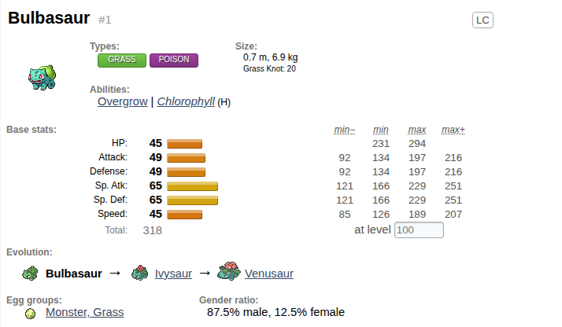
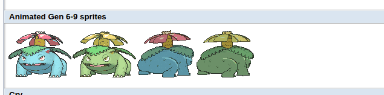
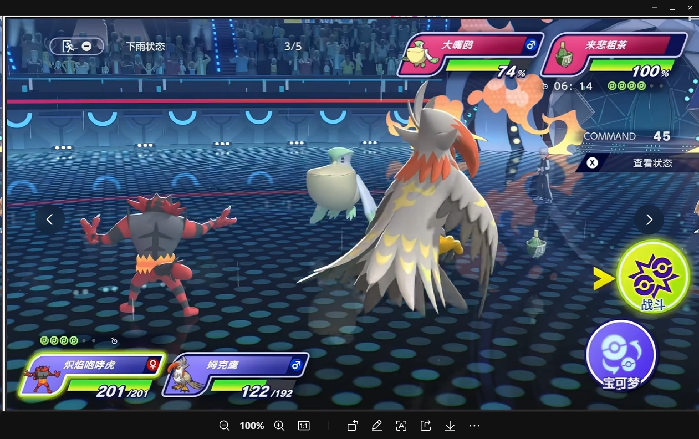
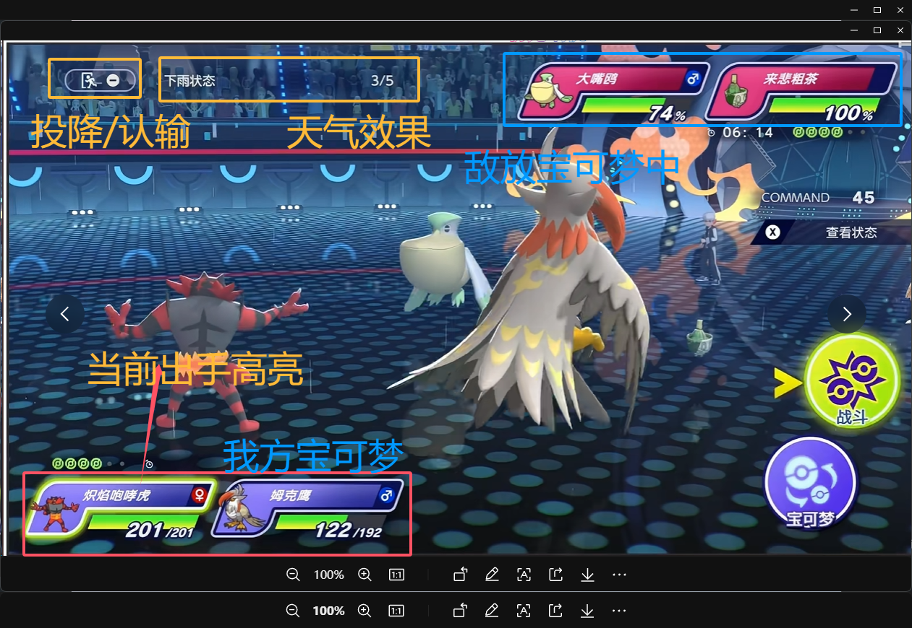
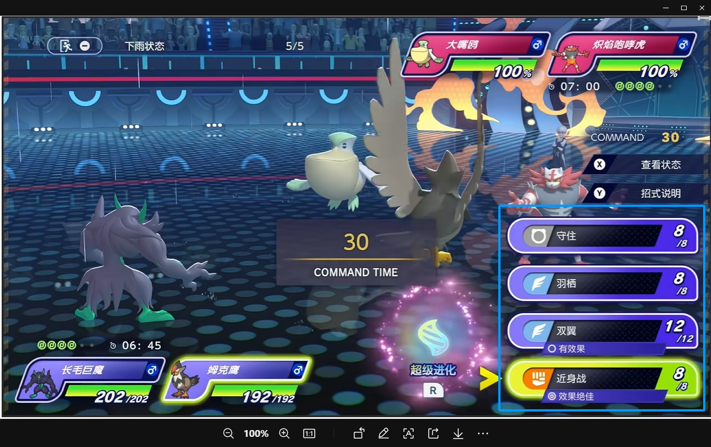
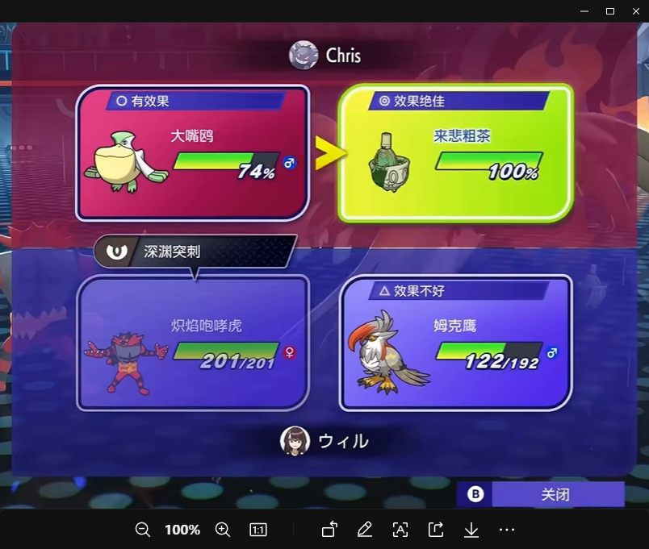
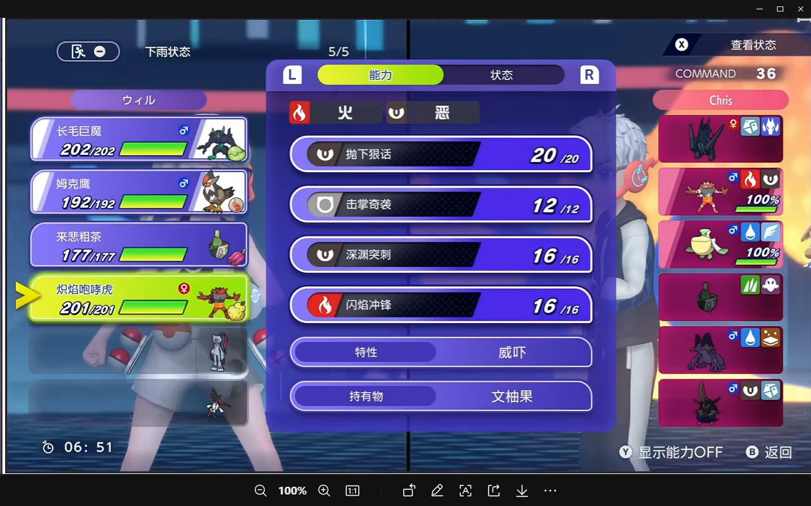

#

下面把/home/alexqfmm/workPlace/pokemon/changeBattle 成为v1 版本

## 图鉴

图鉴不单单是ui这么简单，更多的是我们重要的数据来源

图鉴由以下几个标签页组成 ： 宝可梦 、 技能 、 特性 、 战斗道具 、 （后续我们追加 恢复道具 、 系统道具 、 训练师 ， 这些showdown资源里没有，所以我们需要自己处理数据源）

图鉴ui： 参考原v1的 弹出图鉴ui，做的很不错直接拿过来就行,整体上下两段，上面标签筛选 ， 下面左右两段，左边列表分页，右边详情介绍（内部有二级标签页）； 主要是里面的数据来源内容；

### 宝可梦

宝可梦标签页 右侧详情分为 几 个标签页 ： 详情 、立绘 、 自学技能 、 教授技能、 技能机器、 遗传技能 、 其他技能

#### 详情ui参考如下

支持输入等级查看数值范围，点击特性 跳转对应特性 ，点击进化链和其他形态也能快速跳转

详情加个喇叭按钮，点击后播放对应叫声

#### 立绘ui参考如下

直接把4种立绘一放就行了

#### 技能相关

这个可以直接参考原v1的部分，还有技能卡片，样式都很不错，可以直接拿过来

### 特性、技能等

全部参考v1就行了

## 训练自定义

训练页，用于快速验证完整流程

具体参考v1

支持，单打、双打、合作三个模式； 无特殊系统、gen7（mega+z）、gen8(极巨化)、gen9（太晶化）;

自定义队伍，进入游戏

主要是用于初始化runGame.Player1、2、3、4

PLayer结构可以延续v1

{

name
avatar
localTeam(原来V1三个team还需要么 ， showdownTeam，runtimeTeam，ViewTeam)
bag

}

## 战斗页相关

战斗准备页

详细拆解

技能选择页

带特殊系统

攻击对象选择面板

对局详情列表

