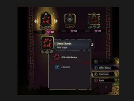
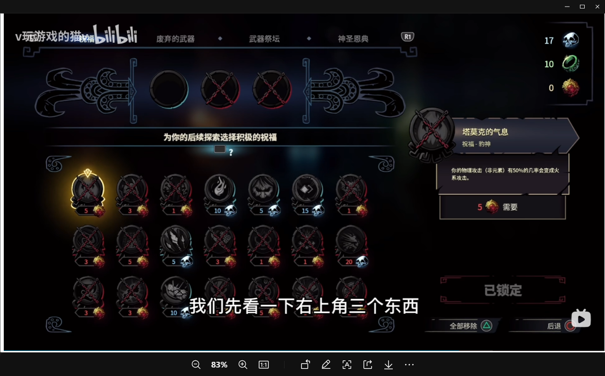

# ChangeBattle 规则草案

ChangeBattle 的核心方向是“宝可梦对战工厂 + Roguelite 养成”。玩家每次挑战都从随机队伍开始，在连续对战中用有限 BP 做休整、购买、改造和交换，尽量把一支临时队伍滚成能打穿 Boss 路线的阵容。

标记说明：`[x]` 表示当前主流程已实现；`[ ]` 表示规则已确定但还没完整落地。若只在某一端完成，会在条目里标注 Desk/CLI。

## 核心目标

- 每一局都有随机队伍、随机对手、随机商店和临时背包，形成局内构筑。
- BP 既是局外成长货币，也是局内临时操作资源，玩家需要在“现在变强”和“长期收益”之间取舍。
- 普通 NPC 提供队伍成长机会，馆主、四天王和冠军提供明确的阶段压力。
- 宝可梦不再只是固定租赁单位，而是可以通过技能、道具、数值、交换和天赋慢慢塑形。

## 核心概念

### 对战点数 BP

BP 是全局共享货币，按整数结算，且不允许为负数。所有旧规则中的 1BP 已统一扩大为 100BP；也就是说 BP 的最小内部单位是旧 BP 的 1/100。任何消费、借用、失败扣除或天赋结算都必须先检查 BP 下限；如果会导致 BP 低于 0，则该操作不能执行或该天赋不生效。

比例结算规则：

- [x] 所有固定费用、奖励和存档余额都使用整数 BP。
- [x] 折扣、返还、倍率和闪光加成允许产生中间小数，但最终入账或扣款时向下取整。
- [x] 旧存档读取时需要自动迁移：旧 1BP 转为新 100BP。

主要用途：

- [x] 新建存档初始化获得 1000BP，作为起始资金。
- [x] 开局重随候选队伍。
- [x] 休整、恢复、技能调整、道具购买、数值重置。
- [x] Desk 解锁天赋。
- [ ] CLI 解锁/配置天赋。
- [x] 部分天赋会改变 BP 的获取、消费和结算规则。

### 战斗背包

战斗背包是局内共享背包，只在当前挑战中使用。

- [x] 道具购买后进入战斗背包。
- [x] 道具可分为恢复类、树果类、战斗道具类、技能机器类。
- [x] Desk 消耗道具允许在战斗中使用，也允许在休整页使用。
- [x] Desk 战斗中主动使用消耗道具会占用当前宝可梦本回合行动，道具效果必定先制，然后对手行动与回合末结算继续由 Showdown 处理。
- [x] Desk 战斗内主动道具只开放 `data/consumable_item_effects.csv` 中的稳定效果；能力提升、清复杂状态、清场地等道具暂不作为主动消耗品开放。
- [ ] CLI 战斗中使用消耗道具。
- [x] Desk 技能机器是一次性消耗道具，使用后从战斗背包中移除。
- [x] Desk 所有道具默认支持半价 BP 出售。
- [x] Desk 挑战结束后，背包内剩余道具折算一半 BP 返还玩家。
- [x] Desk 失败时是否返还可能受天赋影响。

### 天赋

天赋是局外养成系统。

- [x] Desk 使用 BP 解锁。
- [x] Desk 开始挑战前配置。
- [x] 同时最多携带 5 个。
- [x] 天赋主要分为 4 个方向：交换、赌徒、先知、经营。
- [x] 休整页需要随时展示本局已携带天赋，至少能看到天赋名称、分类和当前效果说明。
- [ ] CLI 天赋解锁/配置 UI。

已确定的交换天赋：

- [x] 爱护有加（200BP）：交换获得的宝可梦会恢复到 3/4 HP 和 3/4 PP。
- [x] 顺手牵羊（300BP）：交换时如果目标宝可梦携带道具，则会一起拿过来。
- [x] 馆主认可（1500BP）：馆主和四天王宝可梦不再受默认只能交换 1 只的限制；默认情况下馆主/四天王宝可梦只能交换 1 只，且交换费用为 200BP。
- [x] 工厂自由（3000BP）：所有交换免费。
- [x] 二队的怒吼（5000BP）：三只宝可梦都阵亡后，可以选择损失 1000BP 进入第二次 6 选 3，重新进行当前场比赛；一局游戏仅可触发一次。若 BP 不足或玩家放弃，则正常结算失败。
- [x] Desk 无损交易（5000BP）：拥有一个特殊的宝可梦盒子，将这一局遇到的所有宝可梦都寄存其中，休整页可免费从盒子交换且允许再次交换回来。

已确定的赌徒天赋：

- [x] 灵感爆棚（500BP）：技能随机时数量从 2 个提升到 3 个。
- [x] 大手一挥（500BP）：商店老虎机格子数量从 3 个提升到 4 个。
- [x] 时也命也（1000BP）：重置数值时有 60% 概率不消耗 BP、30% 概率双倍消耗 BP、10% 概率正常消耗。
- [x] 座上贵宾（2000BP）：每次休整获得一次免费商店抽奖机会；本次休整后续商店抽奖消耗为基础费用的 1.3 倍，即 195BP，免费次数不会结转到下一次休整。
- [x] Desk 孤注一掷（5000BP）：每局比赛限一次，指定生成一只宝可梦用于交换；交换后，队伍内另外两只宝可梦均会陷入半血睡眠状态且立即结束本次休整。

已确定的先知天赋：

- [x] 上帝只眼（500BP）：对战时可以看到哪些技能克制当前对手。
- [x] Desk 未卜先知（1000BP）：每次休整可免费随机查看下一场 1 只对手宝可梦的图片和名字；花费 300BP 可查看对手全部宝可梦的图片和名字。
- [x] Desk 温故知新（1500BP）：休整页允许查看上一轮对手的宝可梦详情。
- [x] Desk 运筹帷幄（2000BP）：调整技能时不再随机，可直接从可学习技能池选择一个技能替换，每次 300BP。
- [x] 慧眼识珠（5000BP）：开局从 12 只候选宝可梦中选择，而不是 6 只。
- [x] Desk 预知未来（5000BP）：可以直接看到本局关底的训练师详细阵容。

已确定的经营天赋：

- [x] 有备无患（500BP）：开局可以选择 3 个起始道具。
- [x] 贵客专享（1500BP）：购买道具时专享 70% 折扣，向下取整。
- [x] Desk 精打细算（2000BP）：背包返还时返还 70%，而不是 50%。
- [x] Desk 奇货可居（3000BP）：卖出道具时能原价出售。
- [x] 护符金币（5000BP）：所有 BP 正向结算按 1.5 倍结算，包括小场胜利、额外奖励和最终通关结算。
- [x] Desk/CLI 闪光收藏家（5000BP）：任意交换到的宝可梦均为闪光，且闪光带来的 BP 加成变为 1.3 倍。

## 一局挑战流程

### 1. 天赋配置

- [x] Desk 主页提供天赋配置页。开始挑战前可以查看、解锁和配置本局携带天赋；每次挑战最多携带 5 个，已解锁和已携带状态需要写入存档。
- [ ] CLI 天赋配置入口。

### 2. 开局道具选择

每次开始游戏前，除了天赋，还可以选择开局道具。开局道具只在本局挑战中有效。

- [x] Desk 从商店白名单道具池中随机抽取 5 个开局道具，排除宝可梦球、化石、进化石、卖钱道具等非战斗用途道具。
- [x] Desk 其中 1 个为 7 折，1 个为 5 折，1 个为 3 折，其余为原价，费用向下取整。
- [x] Desk 未购买开局道具前，可以花费 100BP 重新随机开局道具。
- [x] Desk 默认只能购买 1 个开局道具；拥有对应经营天赋时可以购买 3 个。
- [x] Desk 可以跳过，不购买开局道具。
- [x] Desk 开局道具进入战斗背包，但不计入对局结束时的背包返还结算。
- [ ] CLI 开局道具选择流程。

### 3. 开局选队

开局展示 6 只随机宝可梦，玩家选择 3 只组成初始队伍。

右上角新增“换一批”按钮，最多可重随 3 次：

- [x] 第 1 次：免费
- [x] 第 2 次：100BP
- [x] 第 3 次：200BP

- [x] 选完 3 只后不立刻开战，先进入等待/休整页，允许玩家进行初始整理。

### 4. 连续对战

每轮挑战按 7 场小战斗推进。

历史连续通关数会影响 Boss 路线。Boss 战固定出现在第 3 场和第 7 场：

| 历史连续通关数 | 第 1-2 场 | 第 3 场           | 第 4-6 场 | 第 7 场           |
| -------------- | --------- | ----------------- | --------- | ----------------- |
| 0              | 普通 NPC  | 一档馆主          | 普通 NPC  | 二档馆主          |
| 1              | 普通 NPC  | 二档馆主          | 普通 NPC  | 三档馆主 / 四天王 |
| >= 2           | 普通 NPC  | 三档馆主 / 四天王 | 普通 NPC  | 冠军              |

- [x] 普通 NPC 使用四阶段规则随机生成队伍。
- [x] Desk 普通战随机选择路人 NPC 立绘。
- [x] Desk Boss 战按路线随机选择对应馆主、四天王或冠军 NPC 立绘。
- [x] 馆主、四天王和冠军使用 `data/boss_team_pools.csv` 的 Boss 队伍池结构；当前已自动生成 4 组 3 只代表队伍，来源为神百“同行宝可梦”提取、手工高置信代表和阶段兜底。
- [x] Boss NPC 资源表已预留 `team_pool_ids`，Desk 会按路线选择 NPC，再从其队伍池随机选择 1 组 3 人队。
- [ ] 馆主、四天王和冠军的正式手工固定队伍配置继续补全与平衡；这指的是后续人为设计的两套 6 只完整配置，不是当前自动代表队伍池。

### 4.1 敌方 AI 强弱规则

敌方 AI 强弱不只靠数值，也靠“知道多少”和“思考多深”区分。AI 会在每个回合玩家操作开始前异步启动决策，基于当时的战斗快照预先计算敌方选择；玩家点击出招、换人或使用战斗道具时只等待这份预案完成，不在玩家点击后重新读心式计算。

| 敌人类型 | AI 档位 | 情报范围 | 决策能力 | 随机性 |
| -------- | ------- | -------- | -------- | ------ |
| 普通 NPC | `normal` | 知道玩家后排物种，不知道全部招式/道具 | 会根据克制、伤害、击杀机会和换人风险做基础判断 | 较高，保留路人训练家的失误感 |
| 一阶/二阶馆主 | `gym_low` | 知道玩家队伍物种和大致属性 | 小候选搜索往后模拟 1 回合，预测玩家最合理的 1-2 个行动 | 中等 |
| 三阶馆主 | `gym_high` | 知道玩家队伍、招式、道具和速度线 | 小候选搜索往后模拟 2 回合，更重视反杀、换人和残局 | 较低 |
| 四天王 | `elite4` | 知道玩家队伍、招式、道具和速度线 | 小候选搜索往后模拟 2 回合，候选数量和预测权重更高 | 低 |
| 冠军 | `champion` | 近似全知 | 小候选搜索往后模拟 3 回合，近似全知但保留少量随机和后续性格偏好，避免机械读心 | 很低 |

当前第一版 AI 已实现：

- [x] 每回合开始时为敌方启动异步预计算，并缓存本回合敌方选择。
- [x] 玩家出招、换人和使用战斗道具都消费同一份敌方预案，避免点击后重新计算造成读心感。
- [x] 敌方出招从纯随机升级为评分选择：基础威力、属性克制、STAB、命中率、击杀机会、低血量先制和自损风险都会影响评分。
- [x] 敌方会按 AI 档位评估状态招、强化招、场地/天气/撒场类招式。
- [x] 敌方会按 AI 档位考虑主动换人，当前主要参考当前火力、承伤风险、低血量和后排反制压力。
- [x] 馆主、四天王和冠军启用小深度搜索：一阶/二阶馆主往后模拟 1 回合；三阶馆主/四天王往后模拟 2 回合；冠军往后模拟 3 回合。
- [x] 搜索只枚举双方最高评分的少量候选行动，并有每回合预算：普通 NPC 25ms，低阶馆主 120ms，高阶馆主 280ms，四天王 450ms，冠军 900ms。
- [x] 性格偏好只对冠军启用，不扩散到普通 NPC、馆主或四天王。当前支持均衡、进攻、防守、异常消耗、强化、适应六类偏好。
- [x] 冠军性格映射：赤红/阿渡/阿戴克/库库伊/丹帝/妮莫偏进攻；大吾/也慈偏防守；米可利偏异常消耗；艾莉丝/卡露妮偏强化；青绿/竹兰偏适应；未匹配冠军偏均衡。

### 5. 战后选择

每场胜利后进入战后处理：

- [x] 交换宝可梦
- [x] 休整恢复
- [x] 调整技能
- [x] 更换携带道具
- [x] Desk 使用战斗背包道具
- [ ] CLI 使用战斗背包道具
- [x] 重置数值
- [x] Desk 随机商店购买道具
- [ ] CLI 随机商店购买道具
- [x] 进入下一场
- [x] 中断挑战

- [x] 中断挑战会结束本局，并将当前连胜归零；历史最高连胜不归零。

## 宝可梦生成规则

随机生成的宝可梦需要按当前路线阶段逐步变强，而不是所有场次都使用同一强度。

- [x] 新增 `data/pokemon_tiers.csv`，覆盖当前 Gen7/USUM 可用且有图资源的宝可梦；第一版按 Showdown 随机对战强度、种族值、进化阶段、传说/幻兽等自动评分分为 4 阶，并保留 `override_tier` 供后续手工微调。
- [x] CLI 和 Desk 的开局候选、普通 NPC、Boss、二队重选均走四阶段生成接口。
- [x] 生成时优先使用 Showdown Gen7 random set 作为专业技能、特性、道具基础；若 Showdown 无法生成，则回退到合法技能池和随机特性/道具。
- [x] 所有阶段默认保留 1/30 闪光概率，并在 display/save 中记录 `shiny`。
- [x] 休整页“重置数值”无视阶段规则，继续按现有合法随机重置。
- [x] 结算获取 BP 时，队伍中每有 1 只闪光宝可梦，场次结束 BP 乘以 1.1；拥有闪光收藏家时，每只闪光的 BP 加成变为 1.3 倍。
- [x] 开局候选不默认保底闪光；拥有“好运连连”时才会额外提高/保底闪光，连胜 0 有额外概率补闪，连胜 1 起若本轮无闪则补 1 只，连胜 >=2 时优先补到三阶候选上。

阶段现在拆成两层：

- `stage_tier` / `generation_profile`：强度模板，决定等级、个体值、努力值、道具、性格。
- `species_tier`：物种来源档位，决定从 `data/pokemon_tiers.csv` 的哪一档物种池抽。
- 二者可以不同，例如一只 `species_tier=3` 的宝可梦可以套 `generation_profile=tier1`，表现为“普通形态/高档物种，但一阶数值”。
- 指定物种的场景不走混合物种池，例如 Boss 代表队伍、交换升阶时保留原物种；这些场景只套对应强度模板，并记录该物种原本的 `species_tier`。

物种来源混合策略：

| 强度模板 | 物种来源规则 | 说明 |
| -------- | ------------ | ---- |
| 一阶     | `20% 一阶物种 + 60% 二阶物种 + 20% 三阶物种` | 一阶强度不再只从一阶物种池抽，避免开局过多宝宝/未进化宝可梦；其中一半二阶抽取和全部三阶抽取优先避开 `notes=nfe` |
| 二阶     | `30% 二阶物种 + 70% 三阶物种` | 降低未进化密度，让中前期对手和候选更像正常宝可梦 |
| 三阶     | `100% 三阶物种` | 保持原阶段来源，并优先避开 `notes=nfe` |
| 四阶     | `100% 四阶物种` | 保持原阶段来源 |
| 冠军专属 | `100% 四阶物种` | 使用四阶物种池，但套冠军等级和满训练模板 |

四阶段数值规则：

| 阶段     | 等级  | 个体值总和   | 努力值总和 | 道具         | 性格/配置                                   |
| -------- | ----- | ------------ | ---------- | ------------ | ------------------------------------------- |
| 一阶     | 45-50 | 0-90         | 0-200      | 无道具       | 性格固定认真，技能/特性偏随机               |
| 二阶     | 45-50 | 60-120       | 180-300    | 随机战斗道具 | 随机性格                                    |
| 三阶     | 50-54 | 90-150       | 270-450    | 带道具       | 优先 Showdown 专业配置和适配性格            |
| 四阶     | 55    | 186（全 31） | 510        | 带道具       | 优先 Showdown 专业配置和适配性格            |
| 冠军专属 | 58-60 | 186（全 31） | 510        | 带道具       | 冠军是唯一能突破普通阶段等级限制的关底 Boss |

路线难度分布：

- [x] 开局 6 选 3 按历史连续通关数生成：连胜 0 为 `3 个一阶 + 3 个二阶`；连胜 1 为 `3 个一阶 + 2 个二阶 + 1 个三阶`；连胜 >=2 为 `1 个一阶 + 2 个二阶 + 3 个三阶`。
- [x] 拥有“好运连连”时，开局强度分布提高：连胜 0 为 `2 个一阶 + 3 个二阶 + 1 个三阶`；连胜 1 为 `3 个二阶 + 3 个三阶`；连胜 >=2 为 `1 个二阶 + 4 个三阶 + 1 个四阶`。
- [x] 若天赋把候选数量提升到 12，只按上述 6 格分布循环扩展。
- [x] 普通对手按下一位 Boss 阶段生成 3 只：一档前为 `2 一阶 + 1 二阶`，二档前为 `2 二阶 + 1 三阶`，三档/四天王或冠军前为 `2 三阶 + 1 四阶`。
- [x] Boss 队伍在预处理 CSV 中固定阶段分布：一档馆主 `1 一阶 + 2 二阶`；二档馆主 `1 二阶 + 2 三阶`；三档馆主/四天王 `1 三阶 + 2 四阶`；冠军 `3 四阶 + 冠军专属等级`。
- [x] 普通战交换沿用对手实际生成结果；如果普通对手混出高一阶宝可梦，玩家打赢后可以交换到那只高一阶宝可梦。

Boss 代表队伍数据：

- [x] 新增 `tools/build_team_generation_data.js`，从 `npcAbout.zip` 的神百页面中提取馆主、四天王、冠军“同行宝可梦”关系。
- [x] 新增 `data/boss_representatives.csv`，记录 NPC 与代表宝可梦关系。
- [x] 新增 `data/boss_team_pools.csv`，每个 Boss 自动生成 4 组 3 只代表队伍；优先代表宝可梦，缺口按阶段池和主题属性补齐。
- [x] 对赤红、竹兰、大吾、米可利、阿戴克、艾莉丝、卡露妮等冠军加入高置信手工代表兜底，避免网页表格缺失时完全退回随机池。
- [x] Desk Boss 战按所选 NPC 的 `team_pool_ids` 抽取对应队伍池。
- [x] CLI Boss 战当前按路线前缀从对应队伍池随机抽取队伍；暂不展示具体 NPC。

## 交换规则

普通交换获得的宝可梦不再是满状态。

- [x] 默认交换：新宝可梦 HP 和 PP 只有一半，不携带道具。
- [x] 移除“宝可梦被交换走时返还一半点数”的设定。
- [x] 馆主和四天王宝可梦默认只能交换 1 只，交换费用为 200BP；拥有馆主认可后解除该限制。冠军宝可梦默认不可交换，除非后续有专门设计。

## 队伍交互

队伍内宝可梦统一使用弹窗查看，但不同页面允许的操作不同。休整页负责养成和改造；对战页只允许查看、换人和战斗内合法操作。

### 休整页队伍交互

休整页点击我方宝可梦后显示养成菜单：

- [x] 查看信息
- [x] 更换技能
- [x] 更换携带道具
- [x] 使用道具
- [x] 重置数值

- [x] 这些操作只在休整页开放，不能在对战中使用。

### 对战页队伍交互

对战页点击“宝可梦”按钮，或点击我方场上宝可梦/HP 面板时，弹出队伍查看与换人界面。

对战页弹窗包含：

- [x] 左侧：我方当前队伍，可点击切换查看。
- [x] 右侧：基础信息、技能两个标签页。
- [x] 底部：换人、关闭。
- [x] Desk 对战页使用道具统一从主操作区“背包”进入，不在宝可梦详情弹窗里提供入口。

对战页不展示以下休整操作：

- [x] 更换技能
- [x] 更换携带道具
- [x] 重置数值

- [x] Desk 对战页“背包”只展示战斗中合法使用的消耗道具，例如恢复药、异常恢复、PP 恢复、部分树果或战斗道具。
- [x] Desk 强制换人时不能使用战斗背包，必须先完成换人。
- [ ] CLI 对战页“使用道具”可用。
- [x] Desk 技能机器不能在战斗中使用，只能在休整页使用。

### 玩家设置与训练家出场

- [x] Desk 主页提供玩家设置入口。
- [x] Desk 新游戏和玩家设置只配置昵称、玩家角色和头像，不再要求选择性别。
- [x] Desk 玩家角色使用正面图选择；进入战斗时自动使用该角色背面图。
- [x] Desk 头像使用固定大小方格展示，保存后在主页和后续 UI 使用。
- [x] Desk 战斗开始先播放训练家入场：玩家背面从左进入，NPC 正面从右进入。
- [x] Desk 入场时显示黑框提示“xx 前来挑战了”，动画结束后再展示宝可梦和 HP 框。
- [ ] CLI 玩家设置与训练家出场。

### 查看信息

展示当前状态：

- [x] HP、异常、PP
- [x] 等级、性别、属性
- [x] 特性、性格、道具
- [x] 技能详情
- [x] 个体值、努力值、能力值

### 更换技能

技能调整改为抽取式。

- [x] 默认展示 2 个抽取位置。
- [x] 点击抽取花费 200BP。
- [x] 从该宝可梦可学习技能池中随机抽取 2 个技能。
- [x] 玩家选择其中一个，替换当前技能之一。
- [x] Desk 若拥有对应先知天赋，可以改为直接从技能池中选择。

### 更换携带道具

- [x] 从战斗背包中选择可携带道具，给指定宝可梦装备。

### 使用道具

从战斗背包中选择道具使用。

支持类型：

- [x] 血药
- [x] PP 恢复
- [x] 异常恢复
- [x] 部分稳定树果，例如橙橙果、文柚果、苹野果和解除主要异常的树果。
- [x] Desk 技能机器

- [x] Desk 消耗道具在战斗内和休整页都支持使用。
- [x] Desk 战斗内使用消耗道具可指定我方全队合法目标；目标不需要对应效果时不消耗道具、不推进回合。
- [ ] CLI 消耗道具在战斗内使用。
- [x] Desk 技能机器属于一次性道具，但只能在休整页用于调整技能。

特殊交互：

- [x] 单个 PP 恢复需要选择具体技能。
- [x] Desk 技能机器需要选择被替换技能，不再额外花费 BP 学习。
- [x] Desk 技能机器使用后消耗。

### 重置数值

不再精准控制数值，改为随机生成。

- [x] 特性：100BP 随机合法特性
- [x] 性格：100BP 随机性格
- [x] 个体值：100BP 随机合法个体值
- [x] 努力值：100BP 随机合法努力值
- [x] 整体重置：200BP 重新随机全部数值

## 商店规则

道具购买不再是统一列表购买，普通休整商店改为局内老虎机随机商店。

UI 参考：

商店交互：

- [x] 从左往右弹出大框。
- [x] Desk 打开商店后点击抽奖，3 个框滚动；拥有大手一挥时改为 4 个框。
- [x] 普通商店每次抽奖需要 150BP；拥有座上贵宾时每次休整获得一次免费商店抽奖机会，本次休整后续抽奖为 195BP。
- [x] 每次普通商店抽奖至少出现一个回复药类道具；回复药类只包括伤药/好伤药/厉害伤药/全复药/复活/元气药块/复活草/万灵药/解异常药/粉根草药等，不包括树果和 PP 药。
- [x] 抽取采用有放回规则，因此可能出现多个相同道具。
- [x] 抽取停止后展示 3/4 张商品卡，玩家可以买其中 1 张，也可以跳过不买。
- [x] 抽取结果在重新抽奖前保留，重新打开商店仍能看到当前卡牌。
- [x] 抽取后仍需要额外支付 BP 购买商品。
- [x] 购买后放入战斗背包。

重复奖励：

- [x] Desk 抽到 2 个一样的商品，自动免费获得 1 个。
- [x] Desk 抽到 3 个一样的商品，自动免费获得 2 个。
- [x] Desk 抽到 4 个一样的商品，自动免费获得 3 个。
- [x] Desk 抽到 5 个一样的商品，自动免费获得 4 个。
- [x] Desk 同时出现多组重复时，只按最大同名组结算；并列时取从左到右最先出现的一组。

商品池：

- [x] Desk 普通商店使用 `data/shop_pool.csv` 专用随机池。
- [x] Desk 普通商店不再直接从 Showdown 全道具池抽取，避免宝可梦球、化石、卖钱道具、进化石等污染池子。
- [x] Desk 开局道具池也使用 `data/shop_pool.csv` 专用随机池。
- [x] Desk 普通商店和开局道具先按类目总权重抽取，再按 CSV 内部权重抽具体商品：恢复药 65%、PP 药 15%、树果 10%、技能机器 5%、战斗道具 5%。
- [x] Showdown 对战道具 Dex 不收录伤药、饮料、粉根草药、PP 药等训练家背包药品；Desk 对这类商品使用本地药品详情和 `data/consumable_item_effects.csv` 效果表，图标仍从 Showdown itemicons 导入。
- [x] 恢复药，包括血药、复活药、复活草、解麻药、万能粉等治疗/复活/解异常道具。
- [x] PP 药
- [x] 树果
- [x] 战斗道具
- [x] 技能机器

道具图片：

- [x] Desk 从 Showdown itemicons 白名单下载商店池图标到 `assets/items`，保证离线可用。
- [x] Desk 缺失的道具图标回退到 `assets/placeholders/item.png`，技能机器使用技能占位图。

## 休整规则

保留原有恢复类操作：

- [x] 每次休整可以免费恢复 1 次 HP：选择 1 只宝可梦，立即恢复满 HP。
- [x] 每次休整可以免费恢复 1 次 PP：选择 1 只宝可梦的 1 个技能，立即恢复 10 点 PP。
- [x] 每次休整可以免费恢复 1 次异常：选择 1 只宝可梦，立即解除一次异常状态。

- [x] 休整按钮需要展示本次操作实际花费。

示例：

- [x] 三项基础恢复每次休整各限 1 次，使用后显示“已使用”。
- [x] 如果目标不需要对应恢复，则不消耗本次免费次数。
- [x] 额外续航主要依赖商店、战斗背包、树果、技能机器/技能调整和交换策略。

- [x] 休整页需要固定提供“当前天赋”入口或展示区。玩家在每次战后休整时，都能随时查看本局携带的天赋及其效果，方便判断交换、商店、技能调整、重置数值和结算相关操作是否受天赋影响。

## Boss 系统

NPC 分为四类：

- [x] 普通 NPC
- [x] 馆主
- [x] 四天王
- [x] 冠军

- [x] Desk 使用 `data/npc_trainers.csv` 维护玩家、路人、馆主、四天王、冠军和头像资源。
- [x] Desk 玩家角色池剔除不应给玩家使用的关键 NPC；阿渡、黑连等保留在对应 Boss 身份。
- [x] Desk 普通 NPC、Boss NPC 和玩家角色都使用本地资源路径，不依赖联网图片。
- [x] Desk NPC 数据结构预留 `team_pool_ids`，后续可接正式 Boss 队伍池。

### 普通 NPC

- [x] 普通 NPC 使用随机队伍，是主要的局内成长来源。

### 馆主

馆主分为三个难度：

- [x] 一档馆主
- [x] 二档馆主
- [x] 三档馆主

- [x] 当前已为馆主自动生成 4 组 3 只代表队伍，并按一档/二档/三档阶段分布接入战斗。
- [ ] 正式手工配置目标：每位馆主拥有两套固定 6 只队伍池，每套可组成 4 组 3 只宝可梦。

- [x] 馆主和四天王宝可梦默认只能交换 1 只，交换费用为 200BP；拥有馆主认可后解除该限制。

- [x] 第一版已为馆主生成可运行的代表队伍池。
- [ ] 长期目标是把馆主补成正式手工配置：9 个地区 x 8 位馆主，共 72 个馆主；如果加入四天王和更多冠军配置，数据量会继续扩大，因此固定队伍配置后期逐步补。

### 四天王

- [x] Desk 四天王和三档馆主差不多强度，主要是在三档馆主时机作为候选池随机替代出现。
- [x] 当前已为四天王自动生成 4 组 3 只代表队伍，并接入 Boss 队伍池。
- [ ] 四天王正式手工固定队伍池。

### 冠军

- [x] 冠军是关底 Boss。
- [x] 当前已为冠军自动生成 4 组 3 只代表队伍，并使用冠军专属等级规则。
- [ ] 冠军正式手工配置目标：每位冠军使用固定两套 6 只配置队伍。

- [x] 冠军宝可梦默认不考虑交换，除非后续有专门设计。

- [x] 第一版冠军已生成可运行的代表队伍池。
- [ ] 长期目标至少覆盖 9 位冠军的正式手工配置；四天王加入后再统一扩展 Boss 配置格式。

## 天赋系统

UI 参考：

- [x] Desk 天赋需要先用 BP 解锁，挑战开始前选择携带。每次挑战最多携带 5 个。
- [ ] CLI 天赋解锁与携带配置。

### 交换系

- [x] 爱护有加（200BP）：交换时新宝可梦恢复到 3/4 HP、3/4 PP。
- [x] 顺手牵羊（300BP）：交换时如果对方有道具，则一起获得。
- [x] 馆主认可（1500BP）：馆主和四天王宝可梦不再受默认只能交换 1 只的限制；默认情况下馆主/四天王宝可梦只能交换 1 只，且交换费用为 200BP。
- [x] 工厂自由（3000BP）：所有交换免费。
- [x] 二队的怒吼（5000BP）：三只宝可梦都阵亡后，可以选择损失 1000BP 进入第二次 6 选 3，重新进行当前场比赛；一局游戏仅可触发一次。若 BP 不足或玩家放弃，则正常结算失败。
- [x] Desk 无损交易（5000BP）：拥有一个特殊的宝可梦盒子，将这一局遇到的所有宝可梦都寄存其中，休整页可免费从盒子交换且允许再次交换回来。

### 赌徒系

- [x] 灵感爆棚（500BP）：技能随机时，候选数量从 2 个提升到 3 个。
- [x] 大手一挥（500BP）：商店老虎机格子数量从 3 个提升到 4 个。
- [x] 时也命也（1000BP）：重置数值时有 60% 概率不消耗 BP、30% 概率双倍消耗 BP、10% 概率正常消耗。
- [x] 座上贵宾（2000BP）：每次休整获得一次免费商店抽奖机会；本次休整后续商店抽奖消耗为基础费用的 1.3 倍，即 195BP，免费次数不会结转到下一次休整。
- [] Desk 孤注一掷（5000BP）：每局比赛限一次，生成一只三阶的宝可梦用于交换；交换后，队伍内另外两只宝可梦均会陷入半血睡眠状态且立即结束本次休整。（要展示一下孤注一掷的结果，xx被替换成了 xx ，即将结束休整然后再跳过）

### 先知系

- [x] 上帝之眼（500BP）：对战时可以看到哪些技能克制当前对手。并且允许在对战时查看图鉴
- [x] Desk 未卜先知（1000BP）：每次休整可免费随机查看下一场 1 只对手宝可梦的图片和名字；花费 300BP 可查看对手全部宝可梦的图片和名字。
- [x] Desk 温故知新（1500BP）：休整页允许查看上一轮对手的宝可梦详情。
- [x] Desk 运筹帷幄（2000BP）：调整技能时不再随机，可直接从可学习技能池选择一个技能替换，但每次需要 300BP。
- [x] 慧眼识珠（5000BP）：开局从 12 只候选宝可梦中选择，而不是 6 只。
- [x] Desk 预知未来（5000BP）：可以直接看到本局关底的训练师详细阵容。

查看下一个对手信息的价格：

- [x] Desk 免费：每次休整随机显示一只对手宝可梦，只显示图片和名字。
- [x] Desk 300BP：显示对手全部宝可梦，只显示图片和名字。

查看上一轮对手信息：

- [x] Desk 100BP：查看上一轮对手 3 只宝可梦的全部信息，包括特性、性格、努力值、道具、技能。

### 经营系

- [x] 有备无患（500BP）：开局可以选择 3 个起始道具。
- [x] 贵客专享（1500BP）：购买道具时专享 70% 折扣，向下取整。
- [x] Desk 精打细算（2000BP）：背包返还时返还 70%，而不是 50%。
- [x] Desk 奇货可居（3000BP）：卖出道具时能原价出售。
- [x] 护符金币（5000BP）：所有 BP 正向结算按 1.5 倍结算，包括小场胜利、额外奖励和最终通关结算。
- [x] Desk/CLI 闪光收藏家（5000BP）：任意交换到的宝可梦均为闪光，且闪光带来的 BP 加成变为 1.3 倍。

## 战斗玩法扩展

### 战斗 UI

- [x] Desk 选择技能后不再展示全局白色加载遮罩。
- [x] Desk HP 条按比例显示颜色：大于 50% 为绿色，大于 30% 为黄色，小于等于 30% 为红色。

### Mega 进化

携带 Mega 石且尚未 Mega 时，技能选择区右侧显示 Mega 单选。

选中后：

- [ ] 本回合开始时触发 Mega 进化。
- [ ] 宝可梦发出白光。
- [x] Showdown 已触发 Mega 时，战斗 UI 图片切换为 Mega 形态。
- [ ] 数值按 Mega 后形态更新。

### Z 招式

携带 Z 石时，使用技能时可以选择 Z 招式。

- [ ] 每场战斗只能使用一次。
- [ ] 需要在技能菜单中明确展示 Z 招式入口。

### 极巨化和太晶化

Mega 进化、Z 招式、极巨化、太晶化允许同时存在。如何获取对应道具、如何支付使用成本、如何在一局内分配资源，是运营成本和局内构筑的一部分。

极巨化和太晶化后续确认 Showdown 当前规则、协议和素材支持后再做具体实现。

## 后续实现备注

- [x] 馆主、四天王、冠军先用随机占位数据跑通 Boss 流程。
- [ ] 馆主、四天王、冠军固定队伍逐步补正式配置。
- [x] 需要为战斗中可使用道具和仅休整页可使用道具做基础分类。
- [ ] 需要为 Mega、Z 招式、极巨化、太晶化设计各自的获取成本、使用限制和 UI 入口。

## 图鉴

desk是不是可以做一个功能，全局的按钮，图鉴，点击弹出一个弹窗，标签选择宝可梦，特性，技能，道具，支持文本框搜索；毕竟我们都存在本地了；

1.npc移动到位置后后停2s再扔球，不然太快了

2. 回血道具普遍太贵，统一重新调整

回复药： 50BP
好伤药： 100BP  
绝好伤药： 200BP
全复药: 300BP
满复药： 250BP
活力碎片: 200BP
活力块/复活草： 300BP

3. 移除恢复血量，pp，异常 改为 添加胜利奖励：

普通NPC胜利 => 奖励 两个万灵药（30%） / 两个苹野果（70%） + 绝好伤药 _ 1（70%） / 活力碎片 _ 1（30%） + 全复药 \* 1

boss胜利 => 奖励 一次 商城免费抽奖 + 第一个 格子 3折 ， 第二个格子 5折 ， 第三个格子 7折 （如果有第四个格子则 3 折） + 全复药 _ 2 ， pp全复药 _ 2

4 天赋强化：

爱护有加 => 交换时新宝可梦恢复到 满血满pp,并且能获取其身上的道具

顺手牵羊 => 英才教育（替代） : 交换来的宝可梦品质更高（ui这么写，实际上是 原来一阶 的 变成2阶数值 ， 2阶变3阶 ， 3阶 变 4阶）

灵感爆棚 => 铤而走险[1000] ：大部分行为都有概率获得更好的结果，但也要做好最坏的打算 （发动时要提醒用户，触发了铤而走险， 消耗增加1.5倍 / 本次花费为0）

- 对局中所有BP花费 40% 概率 不消耗BP ，20% 概率消耗 1.5倍 ， 10% 的概率； 不消耗的同时获得同等BP；
- 所有消耗道具使用时30% 不消耗道具 ， 20%概率使用时失败并失去道具。 （仅限休整页，不破坏战斗平衡） ， 10%的概率不消耗的同时获得同等道具；

大手一挥 => 顺手牵羊 : 商店老虎机格子数量从 3 个提升到 4 个 ，候选数量从 4 个提升到 8 个 （默认从 技能抽取数量 2 =》 4）

座上贵宾 => 每次休整获得额外三次免费商店抽奖机会；本次休整后续商店抽奖消耗为基础费用的 1.5 倍，免费次数不会结转到下一次休整。

孤注一掷 ：每局比赛限一次，生成一只三阶的宝可梦用于交换；交换后，队伍内另外两只宝可梦均会陷入半血睡眠状态且立即结束本次休整。（要展示一下孤注一掷的结果，xx被替换成了 xx ，即将结束休整然后再跳过）

上帝之眼[200BP] => 显示每个技能的打击效果[效果一般/效果拔群/收效甚微]，同时 对剧中可以使用图鉴

经验老道[新 ， 300BP] => 未携带这个技能时 只能看见能力值， 个体和努力值都是 ??

好运连连[新， 1000BP] => 携带后，初始选择时更容易随到强力宝可梦，所有/级均为该阶段中位数（45-50 =》 47） + 1（60%）/2（30%）/3（10%）
连胜0： 每6只中 ， 闪光出现率提高至（1/15）， 2只一阶 ， 3只二阶 ， 1只3阶段 （削弱闪光出现率默认恢复到1/30）
连胜1： 每6只中 ， 必定出现一只闪光， 3只二阶 ， 3只3阶段
连胜>=2： 每6只中 ， 必定出现一只闪光，且闪光必为三阶宝可梦， 1只二阶 ， 4只3阶段 ， 1只四阶段

神机妙算[新 ， 2000BP] => 商店抽奖前可以额外花费 100BP 制定本次抽奖道具类型（全指定为恢复、全指定为战斗道具）

未卜先知 ， 温故知新 ， 预知未来 => 夜观天象[5000 BP] : 可以在休整时看本局游戏7场NPC信息以及他们的全部阵容（仅名字和图像）,并额外花费500BP观看 对应NPC阵容的详细信息

有备无患（1000BP）：开局可以选择 3 个免费起始道具。

贵客专享（1500BP）：对局中所有BP花费专享 70% 折扣，向下取整。

精打细算（2000BP）：背包返还时返还 100%，而不是 50%

--- 宝可梦分布

尽可能的均匀在1-9世代 ，经常很多见不到一次
