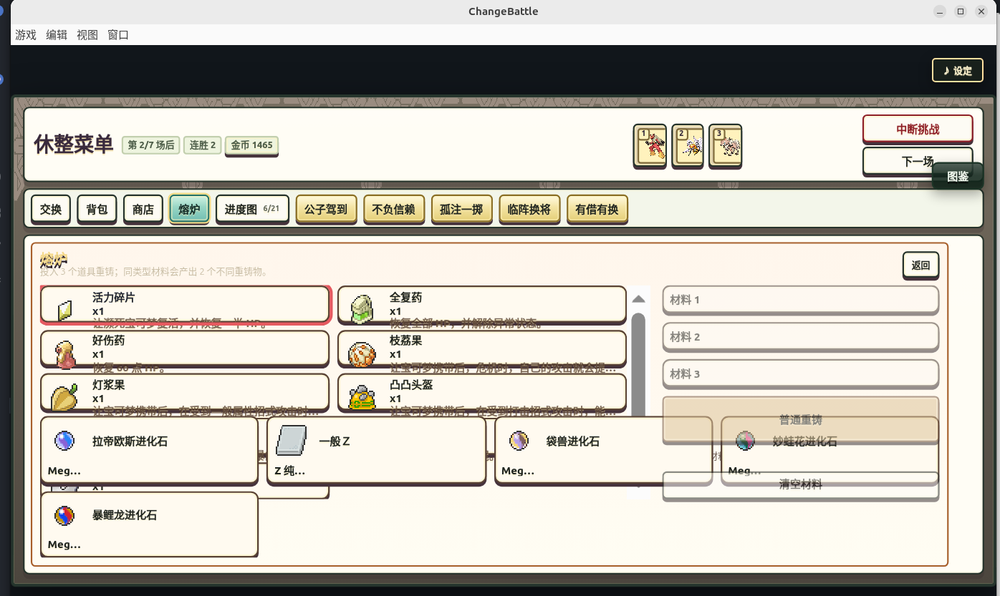
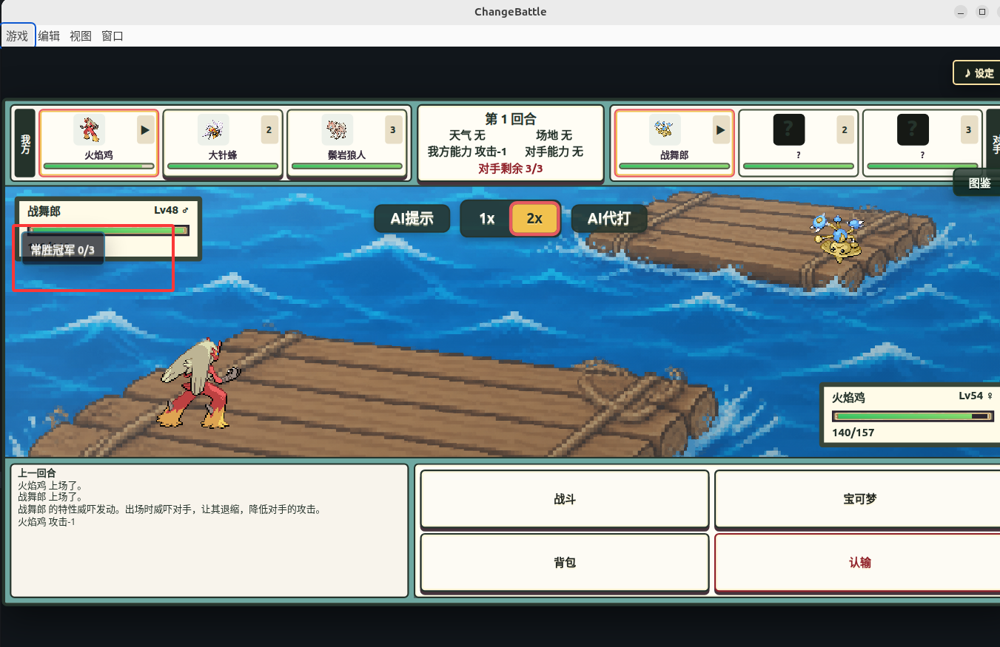
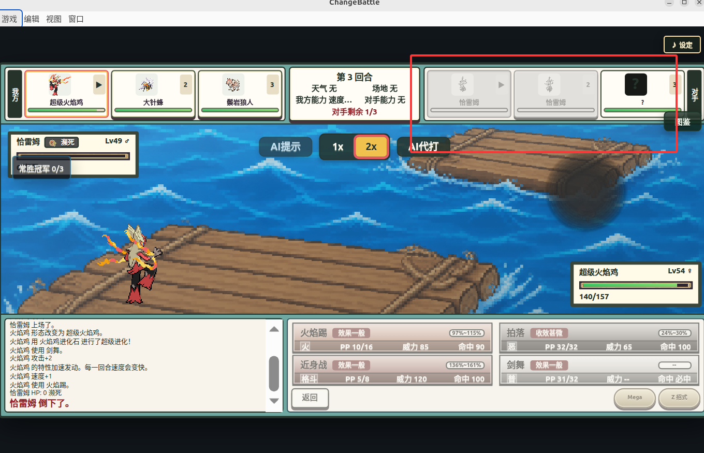
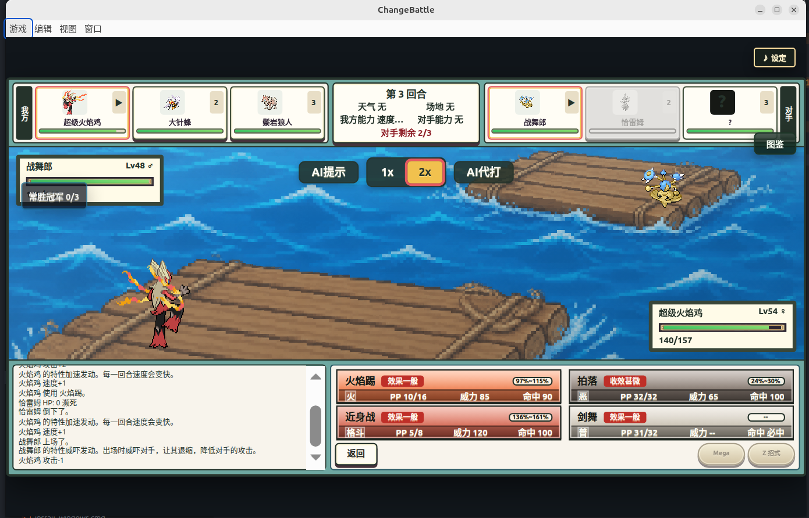
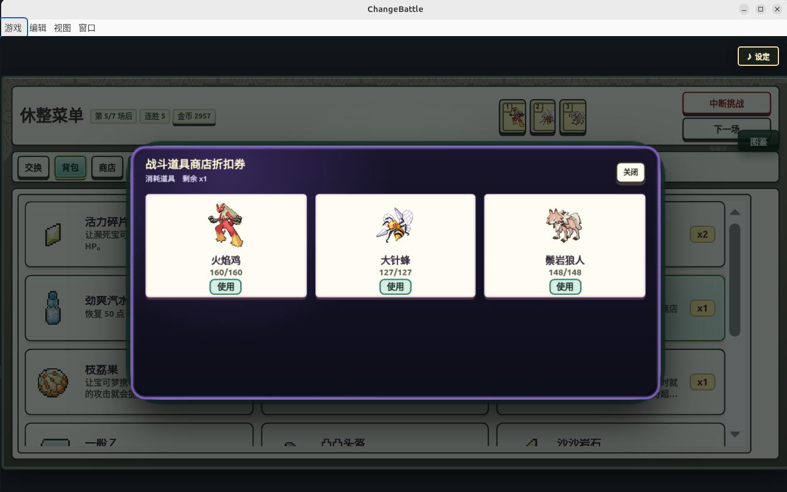
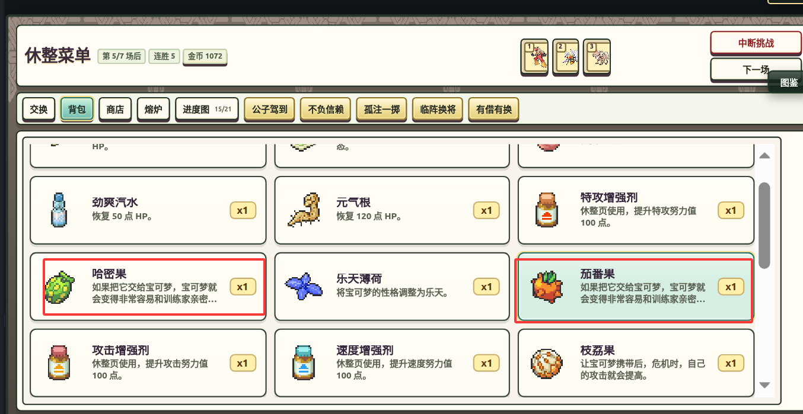

1. 溶炉 ui问题

2. 特殊事件挡住了对手的血条，往下移动一点

3. ui显示问题， 对手的宝可梦的死亡动画还没结束，小窗已经跳到下一只，并且覆盖成了的所对手当前宝可梦，换人后正常

4. 折扣券还要页对一个宝可梦使用

5. 折扣券用了后要有标记，告诉用户当前哪个商店折扣，我现在用了后，看不出来哪个商店折扣了

6. 背包道具看不完整，要不改成左右ui，左边是 道具列表，右边是道具详情， 下面按钮，使用

7. 战绩ui是不是没有做滑动，都挤在一起了，下面的历史战绩图片显示失败是旧存档影响吧，我估计，不管他

