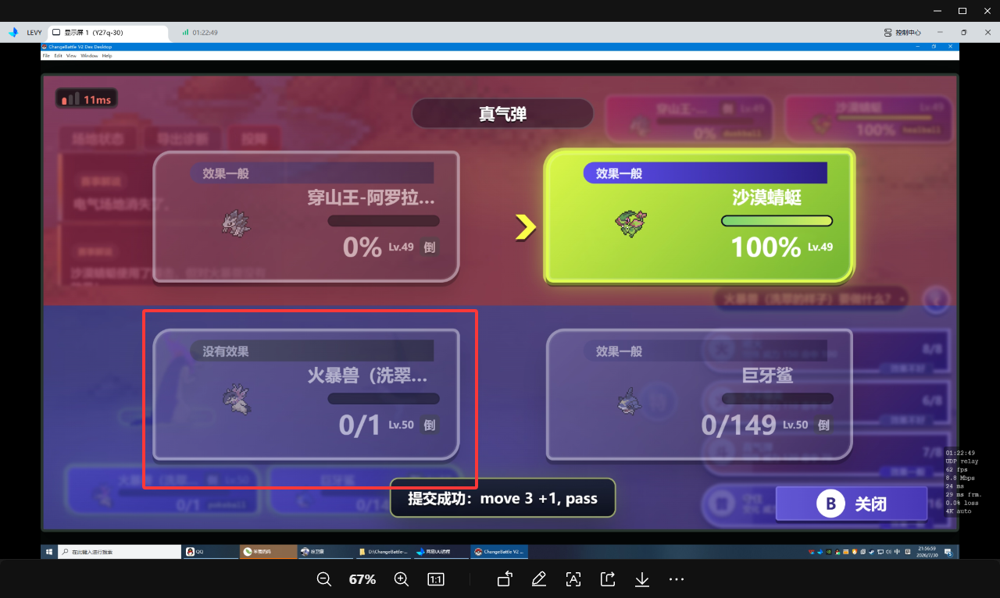
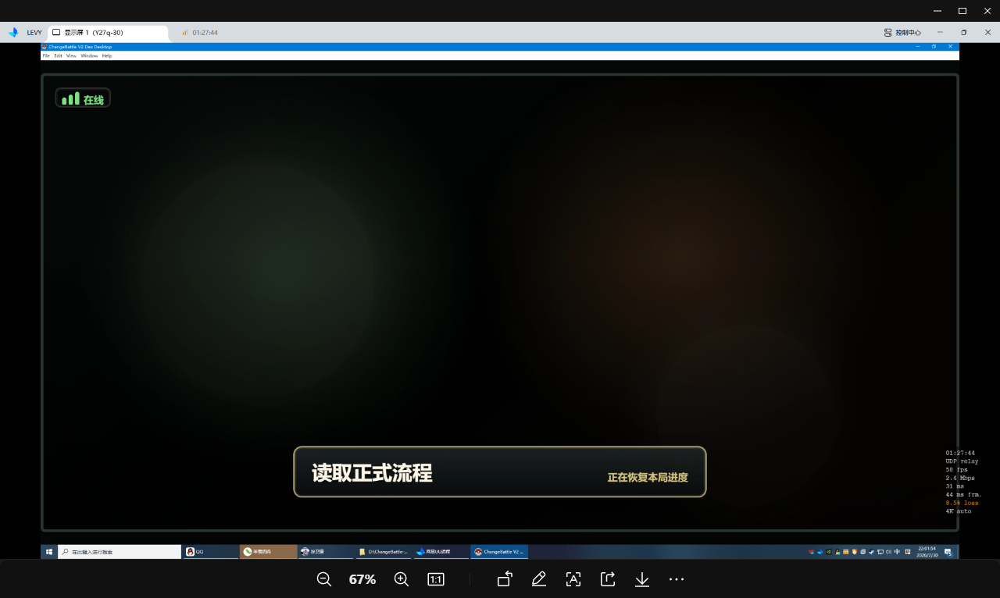

# 人工测试反馈

状态说明：

- `[ ]` 待修改
- `[-]` 已修改，待测试
- `[x]` 已修改，测试完成

## 休整 / 正式房间待处理

1. `[x]` 医疗保险点了后，开局弹窗没有弹出
   - 判断：正式 room UI 还被 legacy 条件挡住。
   - 修复口径：room 模式从 V5 rest scoped view 读取保险 offer，弹同一套保险弹窗，确认走 `insurance.buy` command。

2. `[-]` 使用活力碎片后状态没有更新，但是宝可梦一直活着，永远不死
   - 判断：战斗中训练家道具复活后，battle runtime / snapshot / UI 状态可能没有完全同步。
   - 修复口径：专项复现活力碎片，确保 `hp / fainted / pokemonLeft / request.side.pokemon` 同步一致。
   - 验证状态：已修 runtime/snapshot 同步逻辑；本轮 ChromeAutomation 货架未刷到活力碎片，未完成成功路径验证。
   

3. `[x]` 结算时有概率卡死
   - 判断：room 结算 transition 可能没有稳定拿到 `settlement` scoped view，或失败后停在恢复页。
   - 修复口径：`finalizeRun` 必须返回 `scope: "settlement"` 和可渲染 settlement；前端失败时显示错误/重试。
   

4. `[x]` 移除创建房间时候的地区选择，默认全图选择
   - 判断：体验优化。
   - 修复口径：创建房间 UI 隐藏地区选择，提交时保留默认全地区规则。

5. `[x]` 创建房间时候的“是否神战”没有生效，关闭后 NPC 仍刷神兽
   - 判断：V5 NPC 队伍生成没有把 `legendaryBattle: false` 透传成物种过滤。
   - 修复口径：V5 参赛方生成层原生过滤神兽/幻兽，不走 V4 fallback。

6. `[x]` 玩家初始化获得的宝可梦数值偏弱
   - 目标：技能组已可以；玩家初始宝可梦个体总和 `90-120`，努力总和 `280-320`。
   - 训练目标：以 EV 上限 `510` 为准；训练曲线不要太硬，保证约 4 次训练可接近 IV `181` / EV `510`。
   - 修复口径：加玩家 starter 专用数值规则，不全局拉高 NPC。

7. `[x]` 商店随机道具刷新费用从 50 下调到 10
   - 判断：体验优化。
   - 修复口径：后端刷新费用常量和前端展示文案同步改为 `10`。

8. `[x]` 课程选择后点击返回直接回休整中心不对
   - 期望：已进入某课程时返回课程选择页；课程选择页再返回休整中心。
   - 修复口径：训练场返回逻辑按当前层级分支。

9. `[-]` 交换宝可梦后，交换面板里的数据没有及时更新
   - 现象：队伍已经更新，但交换面板还显示旧数据。
   - 修复口径：交换成功后直接关闭交换面板并清空选择，不继续展示旧 exchange view。
   - 验证状态：已改成功后关闭面板；本轮第一场休整没有上一场对手，未触发交换成功路径。

10. `[x]` 队伍调整顺序保存后，进入战斗还是保存前顺序
    - 判断：服务端有 team reorder 实体写回，但 prepare battle 可能复用旧 active battle session。
    - 修复口径：排序后禁止复用旧战斗会话，或在排序时清理未正式进入的 active battle；加测试确认 Showdown team 顺序等于 `Player.localTeamPokemonIds`。
